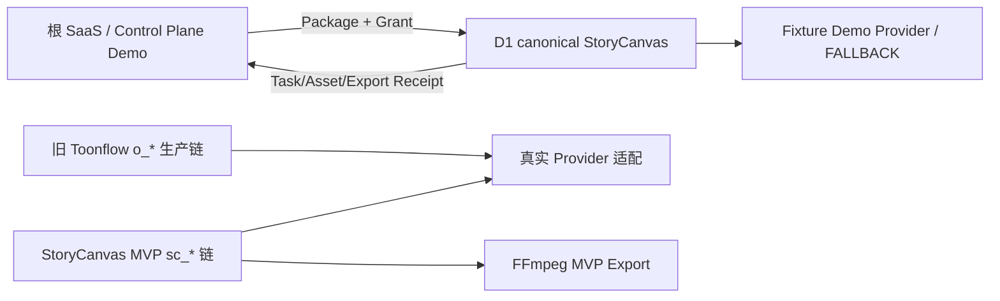

# 视频画布当前架构

## 1. 当前不是单一架构



| 链路 | 数据源 | 当前用途 | 与商业主流程关系 |
|---|---|---|---|
| 根 SaaS | Zustand + LocalStorage Mock | 角色、品牌、脚本、分镜、额度、回执 | 当前演示控制面 |
| 旧 Toonflow | SQLite `o_*` + 本地 OSS | 项目、剧本、素材、图片、视频、Track | 真实生成遗留链 |
| StoryCanvas MVP | SQLite `sc_*` | 连续性、统一任务、媒体、FFmpeg | legacy Header 下实验链 |
| D1 canonical | Package、Grant、Mapping、Receipt、Artifact | 海底捞确定性合同 Demo | 当前画布主路径 |

## 2. 前端调用链

```text
StoryboardPage / ProductionControlSurface
-> create/dispatch ProjectProductionPackage
-> StoryCanvasBridge POST http://127.0.0.1:10588/api/production/v0.1/packages
-> Store 保存 transport + DemoProjectGrant
-> navigate /production/canvas/demo-local-001
-> IntegratedStoryCanvasPage
-> StoryCanvasApp(projectId, grant)
-> mvpApi.bootstrap()
-> canonical Project / Continuity / Task / Asset API
```

当前正式路径是同页 React 内嵌。旧路径仍保留：

```text
storyCanvasBridge.openCanvasWithGrant()
-> window.open(http://localhost:50188/...)
-> postMessage Grant
```

`ProductionControlSurface.test.tsx`证明当前入口不调用 popup。

## 3. 数据库

数据库路径：Node 下 `<cwd>/data/db2.sqlite`，Electron 下 `<userData>/data/db2.sqlite`。数据库初始化会执行 `initDB`、`fixDB`、`runStoryCanvasMigrations`，因此本次审计没有启动 API。

### 旧表

| 表 | 作用 |
|---|---|
| `o_project` | 项目与模型配置 |
| `o_script` | 剧本/单集 |
| `o_assets` | 角色、场景、道具、音频资产 |
| `o_image` | 图片/音频文件版本 |
| `o_storyboard` | 实际单镜头和分镜图 |
| `o_videoTrack` | 视频生成段 |
| `o_video` | 视频版本 |
| `o_agentWorkData` | 画布/Agent 整体 JSON |
| `o_tasks` | 旧模型任务 |
| `memories` | Agent 对话记忆 |

### 新表

| 分组 | 表 |
|---|---|
| Core | `sc_project_profile`、`sc_script_versions`、`sc_scenes`、`sc_shot_metadata`、`sc_media_assets`、`sc_tasks`、`sc_edit_sessions`、`sc_edit_commands`、`sc_timeline_versions`、`sc_external_mappings` |
| Continuity | `sc_continuity_profiles`、`sc_entities`、`sc_entity_versions`、`sc_world_events`、`sc_shot_contracts`、`sc_shot_relations`、`sc_reference_bindings`、`sc_continuity_reviews` |
| Contract | `sc_production_packages`、`sc_production_package_attempts`、`sc_receipt_outbox`、`sc_export_artifacts` |

迁移：`apps/storycanvas/migrations/001_*`、`002_*`、`003_*`。

## 4. ID 映射

```text
external projectId -> sc_external_mappings -> o_project.id
external script-a -> mapping -> o_script.id -> sc_script_versions.id
external shot-01 -> mapping -> o_storyboard.id -> sc_shot_metadata.storyboardId
external asset-* -> mapping -> sc_media_assets.id
external generationTaskId -> sc_tasks.id -> mapping
```

前端 canonical 镜头映射：

```text
canvas shot.id = production shot.order
canvas shot.internalId = production shot.internalId
canvas shot.externalId = production shot.id
```

## 5. API 层

| API 组 | 作用 | 当前主流程 |
|---|---|---|
| `/api/project/*` | 旧项目 CRUD | 否 |
| `/api/script/*` | 旧剧本和资产提取 | 否 |
| `/api/production/storyboard/*` | 旧分镜图片生产 | 否 |
| `/api/production/workbench/*` | 旧视频 Prompt、生成、版本选择 | 否 |
| `/api/mvp/generation*` | 连续性驱动的真实异步生成 | canonical 禁止，legacy Header 才允许 |
| `/api/mvp/continuity*` | 世界记忆读取和更新 | canonical 只读 |
| `/api/mvp/export` | FFmpeg 合并 | 不进入正式 Receipt 链 |
| `/api/production/v0.1/*` | Package、Grant、Demo Provider、Receipt、Artifact | 当前主流程 |

## 6. 保存与恢复

| 状态 | 存储 | 刷新 | 跨设备 |
|---|---|---|---|
| 根 Demo Workspace | LocalStorage | 可恢复 | 不可 |
| Package/Receipt Control State | Zustand/LocalStorage 投影 | 部分可恢复 | 不可确认 |
| Grant | React 内存 | 依赖根 Store 重建 | 不可确认 |
| canonical 项目/Continuity | API/SQLite | API 在线时可重取 | 取决于部署 |
| 画布文字编辑、新增/删除、锁定、缩放 | React State | 丢失 | 不可 |
| 节点拖动位置 | Framer Motion 视觉状态 | 丢失 | 不可 |
| 默认清晰度/时长 | LocalStorage | 可恢复 | 不可 |
| 撤销/重做 | 无历史栈 | 不可用 | 不可 |

## 7. 架构事实风险

- `o_tasks`、`sc_tasks`和 canonical Receipt 是三套任务事实。
- `o_agentWorkData.data`与结构化分镜表构成双事实源。
- MVP Export 不写 `sc_export_artifacts`和 Receipt。
- D1 FALLBACK 是静态登记，不是请求时真实合成。
- `sc_edit_sessions`、`sc_edit_commands`、`sc_timeline_versions`有表但没有生产写入闭环。
- API 启动包含迁移，审计运行不能把“启动服务”视为纯只读操作。

