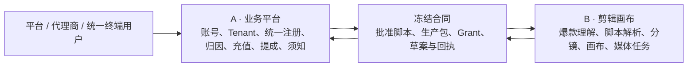

# A/B 共创开发分工 · 业务平台与剪辑画布

> 日期：2026-08-06
> 状态：`APPROVED_FOR_CO-CREATION`
> 适用仓库：`fatdoc/shortVideoAgent`
> 工程师 A：业务平台负责人（合作工程师）
> 工程师 B：剪辑画布负责人（项目发起人）

## 1. 本轮老板决策

本轮按业务控制权拆成 A/B 两条工程线，不按页面数量平均拆分。

1. 企业用户与个人用户不拆分产品端：所有终端创作者使用同一套 `Tenant + Membership + 统一创作工作台`。老板与剪辑画布工作人员共用项目入口，无需切换产品端即可从业务资料进入脚本、分镜和画布。
2. 注册只有一套流程。平台邀请、代理商邀请/分享、用户直接注册是三种获客来源，不是三个注册系统。代理商可从归因用户的有效充值获得提成。
3. 增加版本化用户须知；注册即代表用户主动勾选并同意当前发布版本。正式文案尚未确定，系统先完成版本、发布和同意证据能力，禁止用空文案或占位文案冒充正式协议。
4. 画布增加“爆款合规复刻”：理解参考视频的结构和节奏，复用创作方法，不复制受保护的原文、人物、商标或画面。
5. 画布增加“批准脚本解析 → 分镜草案 → 人工确认”链路。

## 2. 产品边界解释

### 2.1 企业、个人、老板与画布工作人员“合并”的准确含义

合并的是终端产品、工作台体验和创作流程，不是取消服务端权限边界。

- 直接注册用户：服务端在注册事务中自动创建单人 Tenant，并授予本人 `tenant_admin` Membership，可立即进入统一创作工作台。
- 企业用户：继续使用同一个 Tenant 模型；完善企业/品牌资料或邀请成员后，单人 Tenant 原地成长为多人企业 Tenant，不迁移 User、项目或资产。
- 老板/管理员 `tenant_admin`：可管理成员、业务资料、项目、充值和生产，也可直接进入脚本、分镜和画布。
- 剪辑/内容工作人员 `content_operator`：使用同一创作工作台，可操作被授权的项目、脚本、分镜和画布，但不能管理成员、充值、渠道关系或企业高权限配置。
- 不建立独立的 `consumer` 组织类型、C 端角色、C 端工作台或 C 端注册 API。
- 兼容期保留现有角色码；前端移除用户必须在“企业工作台 / 媒体生产工作台”之间切换的体验。
- 后端继续按 Session、Tenant、Membership、Project 做授权，不能因为菜单合并而放大权限。

### 2.2 “代理商分配账号”的安全实现

账号分配统一实现为邀请激活，不允许平台或代理商设置、查看或保存用户明文密码。

- 平台可以创建平台归因或指定代理商归因的邀请。
- 代理商可以创建邀请、生成分享链接、撤销链接、设置有效期和使用次数。
- 用户可以不带邀请直接走同一个注册 API；这类注册来源记为平台直营，不允许事后通过前端参数任意改绑代理商。
- 平台或代理邀请终端创作者时，默认仍进入同一注册流程并创建单人 Tenant；企业管理员邀请工作人员时，邀请必须绑定目标 Tenant，激活后只新增 Membership，不创建第二个 Tenant。
- 定向成员邀请首版默认绑定邮箱、7 天、单次；代理分享链接默认 30 天、最多 100 次；撤销后不可恢复。
- 邀请 Token 数据库只保存摘要；链接过期、撤销或超限后必须失败。

### 2.3 提成的准确口径

提成账与 AI 额度账分离：现金充值、代理提成和模型额度是三种不同事实。

- 只有支付渠道确认到账且满足可计提条件的充值，才产生 `CommissionAccrual`。
- 重复支付事件不得重复加额度或计提佣金。
- 退款、撤单和拒付通过追加冲正记录处理，禁止修改或删除历史账。
- 金额统一使用整数分和明确币种；佣金规则必须版本化并保存计算快照。
- 首版只有直接归因代理获得单级佣金，默认归因保护期 12 个月；不启用旧批发差价正式账。
- 当前只使用明确标记的 TEST Payment 和管理员人工充值；税务、开票、提现和 KYC 未冻结前，只交付可审计的计提/冲正账，不自动打款。
- 佣金具体百分比和退款观察期尚未授权，正式 Commission Rule 保持未发布，工程师不得自行填写比例。

### 2.4 用户须知文案尚未确定时

- 允许创建 `DRAFT` 版本供内部编辑。
- 只有 `PUBLISHED` 版本可以被注册流程引用。
- 没有已发布版本时，公开注册必须 fail closed。
- 同意记录至少保存 `userId`、`termsVersionId`、正文 digest、`acceptedAt` 和注册场景。
- 已发布版本不可原地改写；任何正文变更必须发布新版本。
- 新版本由业务设置 `mustReaccept`；重大版本必须重新同意后才能继续受限操作。

## 3. 顶层架构与事实源



事实源规则：

- A 是 User、Organization、Tenant、Membership、Referral、Terms、Recharge、Commission、Script Approval 的事实源。
- B 是 Reference Analysis、Storyboard Draft Runtime、Canvas Revision、Generation Task、Media Asset、Export 的事实源。
- B 不能直接修改用户、代理归因、充值、佣金、批准脚本或额度账。
- A 不能伪造爆款分析、分镜解析、Provider 任务、媒体资产或导出成功。
- 跨平面对象必须先在 `docs/program/contracts/` 冻结并提供 fixture、错误码、幂等和兼容性测试。

## 4. 工程师 A · 业务平台负责人

### 4.1 A 的工作内容

#### A-BIZ-01 · 企业/个人统一创作工作台

- 将个人创作者、老板的经营入口与脚本、分镜、画布入口合并为一个统一创作工作台。
- `tenant_admin` 默认可见业务管理与内容生产；`content_operator` 只见内容生产和被授权项目。
- 统一 Router、Sidebar、WorkbenchSwitcher、安全回跳和 403 逻辑。
- 保留后端角色差异，不把老板权限直接赋给工作人员。

#### A-BIZ-02 · 真实组织、成员与权限模型

- 建立 Platform、Channel、Tenant、User、Membership 和 Role 数据模型；个人与企业共用同一个 Tenant 类型。
- 支持平台管理员、代理商管理员、企业老板和内容工作人员的服务端授权。
- 将当前 tenant-only Pilot Session 增量迁移为多组织权限上下文。
- 平台/代理商 API 必须按组织范围隔离，跨代理、跨 Tenant 不泄漏资源是否存在。

#### A-BIZ-03 · 单一注册流程与三种获客来源

- 平台创建邀请和用户开通入口。
- 代理商创建邀请、分享链接、撤销、有效期和使用次数。
- 所有终端用户共用注册、登录、退出、会话恢复和账号停用能力；不得复制企业版/C 端两套 API。
- 直接注册以及平台/代理获客邀请默认自动创建单人 Tenant 和 `tenant_admin` Membership；企业成员邀请则加入邀请指定的已有 Tenant。
- 注册事务中冻结 `acquisitionSource`、`referrerChannelId` 和邀请证据。
- 注册端点增加限流、账号枚举保护、幂等和审计。

建议 API：

```text
GET    /api/v1/public/terms/current
POST   /api/v1/public/registrations
POST   /api/v1/platform/invitations
POST   /api/v1/channels/:channelId/invitations
GET    /api/v1/channels/:channelId/invitations
POST   /api/v1/invitations/:invitationId/revoke
GET    /api/v1/invitations/:token/preview
```

#### A-BIZ-04 · 用户须知与同意证据

- 新增 `TermsDocument`、`TermsVersion`、`UserConsent`。
- 管理平台可以创建草稿、发布新版本和查看同意统计。
- 注册请求必须携带当前发布版本和明确勾选；服务端在同一事务校验并写入 append-only 同意记录。
- 正式文案由业务/法务后续提供；工程师不得自行撰写成正式条款。

#### A-BIZ-05 · 充值、代理归因与提成账

- 建立 `RechargeOrder`、`PaymentEvent`、`ReferralAttribution`、`CommissionRuleVersion`、`CommissionAccrual`、`CommissionReversal` 和 `CommissionSettlement`。
- 支付成功后在同一幂等事务中增加用户额度并计提代理佣金。
- 退款通过冲正记录回退额度/佣金；禁止覆盖历史记录。
- 平台查看全局，代理商只查看自己归因范围，用户只查看自己的充值和额度结果。
- 未接真实支付前可使用明确标记的测试支付适配器，但不得把测试到账描述为真实收款。

#### A-BIZ-06 · 前端接线、安全和运营

- 注册、邀请、分享链接、用户须知、成员管理、充值和提成页面。
- 空状态、加载、失败、链接过期、重复提交、退款和账号停用状态。
- 审计日志、管理员人工处理入口、数据导出和最小运营说明。
- 与 B 的脚本/分镜/画布入口使用同一项目上下文。

### 4.2 A 的代码文件边界

A 独占：

```text
apps/control-api/src/auth/**
apps/control-api/src/organizations/**            # 新增
apps/control-api/src/registrations/**            # 新增
apps/control-api/src/invitations/**              # 新增
apps/control-api/src/terms/**                    # 新增
apps/control-api/src/channels/**                 # 新增
apps/control-api/src/billing/**                  # 新增
apps/control-api/src/commissions/**              # 新增
apps/control-api/src/projects/**
apps/control-api/src/briefs/**
apps/control-api/src/scripts/**
apps/control-api/src/approvals/**
apps/control-api/src/db/migrations/006_* 及后续 A 迁移
src/pages/auth/**
src/pages/platform/**
src/pages/channel/**
src/pages/commercial/**
src/pages/dashboard/**
src/pages/brief/**
src/pages/brand-brain/**
src/components/commercial/**
src/components/workbench/**
src/services/pilotControlApi.ts
src/stores/pilotAuthStore.ts
src/domain/*identity*
src/domain/*commercial*
```

A 可以修改但必须单独提交、通知 B：

```text
src/app/Router.tsx
src/layouts/**
src/domain/constants.ts
apps/control-api/src/app.ts
apps/control-api/src/server.ts
README.md
```

A 禁止修改：

```text
apps/storycanvas/**
src/features/storycanvas/**
src/pages/storyboard/**
src/pages/script-editor/**
src/components/script/**
src/components/storyboard/**
```

### 4.3 A 的验收标准

- 同一个人或企业账号从统一创作首页进入脚本、分镜和画布，无需退出或切换产品端。
- 直接注册后在同一事务创建 User、单人 Tenant 和 `tenant_admin` Membership，可立即创作。
- 单人 Tenant 增加企业资料和成员后仍使用原 Tenant、项目和资产，不发生账号或数据迁移。
- 系统不存在独立 `consumer` 类型、C 端角色、C 端工作台和 C 端注册 API。
- 工作人员可以创作，但访问成员管理、充值、提成、平台和代理 API 必须返回 403。
- 平台邀请、代理邀请/分享、用户直接注册三种来源均走同一注册流程，并形成正确且不可伪造的归因。
- 代理商不能设置或获取用户密码；邀请 Token 只存摘要，可过期、撤销和限次。
- 没有当前已发布用户须知、没有勾选或版本/digest 不匹配时注册失败。
- 同意记录可审计且已发布版本不可原地修改。
- 支付成功事件重放不重复充值/计佣；失败不入账；退款追加冲正。
- 代理商只能看到自己归因的用户和佣金；跨组织请求不泄漏资源存在性。
- 密码继续使用慢哈希；Session 使用 HttpOnly Cookie；注册和邀请端点有限流。
- A 定向测试、真实 PostgreSQL 测试、typecheck、build、lint、Governance 和 diff-check 通过。

## 5. 工程师 B · 剪辑画布负责人

### 5.1 B 的工作内容

#### B-CANVAS-01 · 爆款参考视频安全接入与结构理解

产品名称统一为“爆款合规复刻”。

- 上传参考视频或登记合法可访问的参考素材；保存 checksum、MIME、时长、来源和权利声明。
- 使用 ffprobe/FFmpeg、FireRed-OpenStoryline 或成熟适配器完成切镜、ASR、OCR 和画面理解。
- 输出结构化分析：前 3 秒钩子、叙事结构、口播结构、镜头时间轴、节奏、景别、运镜、转场、字幕、声音和 CTA。
- 输出“可复用方法”和“禁止直接复制内容”，不返回去水印、搬运或规避平台识别能力。
- 分析结果只作为 Brief/脚本参考，不能直接成为 A 的批准脚本或生产包事实。

建议合同：

```text
ReferenceVideoAnalysisCommand
ReferenceVideoAnalysisReceipt
ViralStructureBlueprint
```

#### B-CANVAS-02 · 批准脚本解析

- 只消费 A 指定且仍处于批准状态的 ScriptVersion 快照。
- 解析段落、旁白、对白、人物、场景、道具、字幕、情绪、时间预算和事实引用。
- 保留原文定位和解析置信度；无法确定的内容进入人工确认，不静默编造。
- 相同 ScriptVersion/digest/解析策略重放结果稳定，不重复付费调用。

#### B-CANVAS-03 · 分镜草案与人工确认

- 从脚本解析结果生成版本化 Scene/Shot 草案。
- 每个 Shot 至少包含稳定 ID、顺序、时长、画面、口播/对白、字幕、景别、运镜、素材策略、连续性约束和图片/视频提示词。
- 校验总时长、镜头顺序、禁用词、品牌事实、人物/场景连续性和素材权利。
- B 返回草案，不直接覆盖 A 的权威 Storyboard；A 保存版本并发起人工审批。
- 草案批准后，A 重新签发包含正式 Storyboard 的 Production Package。

建议合同：

```text
StoryboardDraftCommand
StoryboardDraftReceipt
StoryboardDraftRevision
```

#### B-CANVAS-04 · 画布持久化与真实生产接线

- 将画布的增删、排序、锁镜、时长、提示词和素材绑定保存为版本化修订。
- 处理并发版本冲突，不用 React 内存状态冒充服务端保存成功。
- 将 v0.2 `GenerationTaskCommand` 从 `providerSubmitted=false` 接到现有图片、海外 BytePlus 视频和后续 TTS Adapter。
- 持久化 Attempt、poll、timeout、cancel、retry，并输出真实 Task/Asset/Usage/Export Receipt。
- Provider 输出通过 MIME、大小、checksum、远程存储和 provenance 校验后才能成功。

### 5.2 B 的代码文件边界

B 独占：

```text
apps/storycanvas/src/agents/**
apps/storycanvas/src/domain/storycanvas/**
apps/storycanvas/src/services/storycanvas/**
apps/storycanvas/src/routes/production/**
apps/storycanvas/src/routes/mvp/**
apps/storycanvas/src/integrations/openstoryline/**
apps/storycanvas/data/skills/**
apps/storycanvas/migrations/**
src/features/storycanvas/**
src/pages/production/IntegratedStoryCanvasPage*
src/pages/script-editor/**
src/components/script/**
```

经 A 提供 route manifest 后，B 可以独占新增的画布业务页面：

```text
src/pages/viral-remake/**                       # 新增
src/pages/storyboard/**
src/components/storyboard/**
```

B 禁止修改：

```text
apps/control-api/**
src/pages/auth/**
src/pages/platform/**
src/pages/channel/**
src/pages/commercial/**
src/domain/controlPlane*
src/stores/controlPlaneStore*
src/services/controlPlane*
Wallet / Ledger / Reservation / Recharge / Commission 相关文件
根 package-lock.json（除非双方明确批准依赖变更）
```

说明：B 维护脚本编辑/解析的前端体验，A 维护 `apps/control-api` 中的 ScriptVersion、Approval 和生产资格事实。B 不直接写 A 的表；审批语义、API 或页面路由需要变化时，先提交合同/route manifest，由 A 完成服务端和共享 Router 接线。

### 5.3 B 的验收标准

- 未提供权利声明的参考视频不能进入爆款分析。
- 相同视频 checksum 幂等，不重复付费分析；成功、失败、超时、取消和重试均持久化。
- 至少一条授权参考视频能稳定得到切镜时间轴、ASR/OCR 和结构标签。
- 输出只复用结构方法，不输出完整第三方脚本、去水印结果或可直接搬运素材。
- 未批准或已撤销的 ScriptVersion 不得生成分镜草案。
- 海底捞批准脚本可稳定解析为 6–10 镜；Shot 字段完整，总时长误差满足冻结阈值。
- 同幂等键同 payload 重放；不同 payload 冲突；B 不修改 A 的审批事实。
- 画布修订可保存、恢复、并发冲突和回滚；刷新后不丢失。
- v0.2 Command 真实提交 Provider 后产生 Task/Asset/Usage Receipt；失败不伪造媒体资产。
- B 定向测试、StoryCanvas typecheck/module check、FFmpeg/Provider contract tests、Governance 和 diff-check 通过。
- 默认 Electron 全库测试若仍受本机 ABI 阻塞，必须与本切片结果分开报告。

## 6. A/B 公共文件与合同边界

以下文件必须双方会签，任何一方不得夹带在大功能提交中修改：

```text
docs/program/contracts/**
docs/program/INTEGRATION_CONTRACT.md
apps/storycanvas/src/contracts/v0.2/**           # C01 生成副本
apps/control-api/src/production/**
src/services/storyCanvasBridge.ts
src/app/Router.tsx
src/domain/constants.ts
README.md
```

公共改动规则：

1. 先写合同/ADR 和正反 fixture，再改 A/B 实现。
2. 公共文件使用独立 commit，不夹带页面重构或 Provider 修改。
3. A/B 对同一对象不能各自复制一套字段定义。
4. 写操作必须有幂等键；跨平面失败必须返回冻结错误码。
5. 日志不得包含密码、Session、邀请 Token、Grant、内部 Token、支付签名或完整用户内容。

## 7. 推荐并行任务图

| Wave | 工程师 A | 工程师 B | 联合 Gate |
| --- | --- | --- | --- |
| 0 | 冻结统一 Tenant、角色、注册来源、归因和须知模型 | 冻结爆款分析、脚本解析和分镜草案对象 | ADR、Schema、fixture、错误码 |
| 1 | 统一创作工作台；真实组织/RBAC | 参考视频接入；爆款结构理解 | 老板单账号进入画布；参考分析不改业务事实 |
| 2 | 单一注册流程、三种来源、邀请、须知同意 | 批准脚本解析；分镜草案 | 注册归因 + ScriptVersion/digest 联合测试 |
| 3 | 充值、佣金计提/冲正 | 画布版本化；v0.2 Provider 执行 | 回执、额度、佣金和媒体来源一致性 |
| 4 | 运营后台、审计、安全 E2E | 导出、失败恢复、媒体 QA | 海底捞白名单黄金路径 |

## 8. Git 与协作规则

建议长期分支：

```text
main
├── dev/business-plane       # 工程师 A
└── dev/canvas-plane         # 工程师 B
```

- 两人每天开工前同步最新 `origin/main`。
- 功能代码通过 PR 合入 `main`；禁止强推、禁止覆盖对方未提交文件。
- 一个 PR 只交付一个任务节点；数据库迁移、API、前端和测试可同属一个业务节点。
- A 不修改 B 独占文件，B 不修改 A 独占文件；确有需要时发 route manifest 或合同请求。
- 合并顺序：合同/ADR → A/B 独立实现 → 跨平面测试 → README/状态更新。
- PR 必须列出修改文件、迁移、API、成功/失败/越权/幂等测试、开源来源、风险和回滚方法。
- 开源复用执行 `docs/program/A05_OPEN_SOURCE_FIRST_POLICY.md`；来源登记到 `docs/program/SOURCE_REGISTER.md`。

## 9. 已冻结决策与后续输入

### 业务侧

已冻结、不得再次作为阻塞提出：

1. 企业与个人统一 Tenant、注册 API 和创作工作台；直接注册创建单人 Tenant 和 `tenant_admin`。
2. Schema 支持多组织/多角色，首版单一活动组织和单一主角色。
3. `pilot_support` 兼容保留但跨 Tenant 必须使用限时 Support Grant；工作人员首版不能创建项目。
4. 定向成员邀请默认7天单次，代理分享链接默认30天/100次，代理归因默认保护12个月。
5. 首版 TEST Payment + 管理员人工充值，购买版本化额度 SKU；购买额度不过期、赠送额度90天。
6. 单级直接归因佣金替代旧批发差价；只交付计提/冲正账，不开放提现和自动打款。
7. 用户须知按版本发布，并使用 `mustReaccept` 控制重大版本重新同意。

仍需老板/法务/财务以后提供，但不阻塞 A 建底座：正式用户须知正文、真实支付商户资料、真实 SKU 价格和额度、佣金具体百分比、退款观察期、税务、开票、KYC、提现和出款规则。未提供前对应正式能力 fail closed。

### 画布侧

1. 爆款参考视频允许的来源、权利声明和平台下载边界。
2. 第一版支持本地上传还是链接导入；最大时长、大小和格式。
3. 爆款复刻的相似度/合规红线和人工审核责任。
4. 脚本解析输入格式、Shot 数量和总时长误差阈值。
5. 分镜草案由谁审批、修改后是否必须重新审批和重新发包。
6. 第一批真实 Provider、成本上限、超时和人工兜底策略。

## 10. 完成定义

一个节点只有同时满足以下条件才能进入 `ACCEPTED`：

- 用户结果可运行，不是静态占位页面。
- 数据进入真实数据库或明确的生产持久化层，不用 LocalStorage 冒充事实源。
- 成功、失败、未登录、越权、幂等冲突和敏感信息泄漏测试通过。
- 跨平面对象通过冻结 Schema 和正反 fixture。
- Test、Typecheck/Build、定向 Lint、Governance 和 `git diff --check` 有真实结果。
- 没有越过 A/B 文件所有权，没有把 Mock/占位/未付费调用描述成真实成功。
- README、任务状态、迁移说明和交接记录同步。
