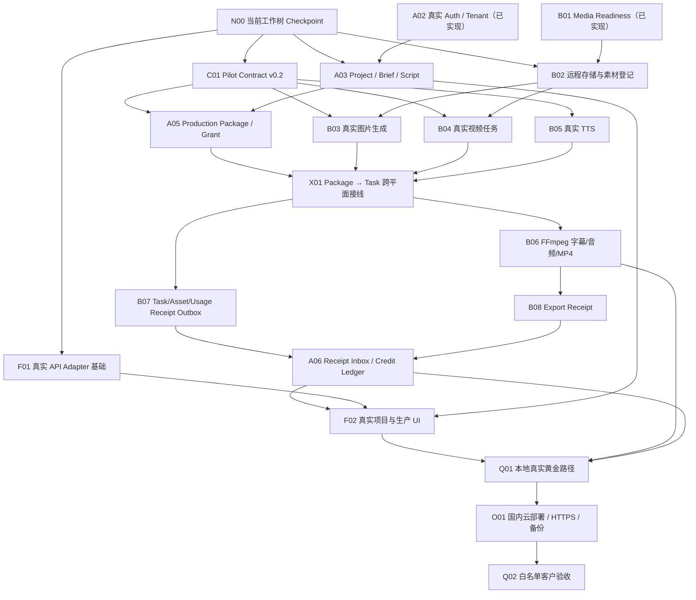

# A-05 真实试点 · 多窗口任务顶层设计

> 版本：`v0.1`  
> 日期：2026-08-05  
> 状态：`ACTIVE / EXECUTION_SOURCE_OF_TRUTH`  
> 适用范围：单客户、白名单、受控真实试点 v0  
> 与历史治理的关系：本文是 A-05 开发执行图，不改写 D1/D2 历史 Gate 和 C0–C8 原始岗位定义。

> 实现策略：所有窗口强制执行 `A05_OPEN_SOURCE_FIRST_POLICY.md`，功能优先复用现有实现、官方 SDK、公开标准和宽松许可的成熟开源项目。

## 1. 我们最终要交付什么

交付物不是一个“可以调模型的页面”，也不是“有一个后端和几张数据库表”。

我们要交付的是：

> **一套企业客户可以用真实账号登录，用真实品牌与素材创建项目，在人工审批的关键节点下调用真实 AI 生成脚本、分镜、图片、视频和配音，最终导出可播放 MP4，并能解释每个任务、素材、回执和额度变化的 AI 短视频生产系统。**

用户真实黄金路径：

```text
白名单账号登录
→ 进入唯一企业 Tenant
→ 建立真实项目
→ 填写/辅助生成 Brief
→ 生成脚本并人工审批
→ 生成分镜并人工确认
→ 上传真实实拍素材
→ 用 AI 生成缺失图片/视频/TTS
→ 任务失败可解释、可重试
→ FFmpeg 拼接、字幕和音频混合
→ 导出独立可播放 MP4
→ 同步 Task/Asset/Export/Usage Receipt
→ 额度 reserve/consume/release 正确入账
```

## 2. 一周完成定义

一周后只能宣称“受控真实试点上线”，而且必须同时满足：

1. 真实账号、服务端 Session 和 Tenant 边界。
2. 项目、Brief、脚本、审批、Package、Grant 来自 PostgreSQL。
3. 用户输入素材和生产输出使用真实远程对象存储。
4. 至少一个真实图片、视频和 TTS 能力，不以 Mock 成功代替。
5. 导出产物是独立新生成的 MP4，不是复用某个镜头素材。
6. 失败、取消、重试和超时至少有一条真实测试证据。
7. 成功任务 consume，失败/取消 release，重放不重复入账。
8. 上游 API Key、Session Token 和 Grant Token 不进入前端、日志或回执。
9. 服务重启后项目、任务、素材、回执和额度可恢复。
10. 有 HTTPS、备份、最小日志/告警和人工运营兜底说明。

不进入一周完成定义：公开注册、支付、发票、自动结算、渠道分销、复杂 RBAC、多区域容灾和多供应商自动调度。

## 3. 任务节点 DAG

### 3.1 节点图



### 3.2 任务节点表

| ID  | 任务节点                                   | 负责窗口     | 前置          | 必须交付的证据                             | 当前状态                  |
| --- | ------------------------------------------ | ------------ | ------------- | ------------------------------------------ | ------------------------- |
| N00 | 当前 A-05.1/A-05.2/B-05.1 Checkpoint       | P0           | 无            | 分支、独立提交、Test/Build 结果            | `ACCEPTED`                |
| A01 | Control API + PostgreSQL 基座              | A1           | 无            | 19 表迁移、health 200、append-only Trigger | `ACCEPTED`                |
| A02 | 白名单 Auth / Session / Tenant             | A1           | A01           | 20/20，实库 login/session/logout           | `ACCEPTED`                |
| B01 | Media Readiness                            | B1           | 无            | 10/10，安全 readiness endpoint             | `ACCEPTED`                |
| C01 | 真实试点合同 `v0.2`                        | P0           | N00           | Schema、fixture、negative vectors、错误码  | `ACCEPTED`                |
| A03 | Project / Brief / ScriptVersion / Approval | A2           | A02           | Tenant 边界、版本、审批阻断                | `ACCEPTED`                |
| A04 | 用户上传授权与素材登记                     | A2           | A02           | 签名、prefix/MIME/size/checksum 校验       | `NOT_STARTED`             |
| A05 | Production Package / Grant                 | A3           | C01, A03      | 审批脚本发包、签名 Grant、幂等             | `ACCEPTED`                |
| B02 | 远程对象存储与生产素材登记                 | B2           | B01           | 远程 key、checksum、provenance             | `ACCEPTED`                |
| B03 | 真实图片生成                               | B2           | C01, B02      | 真实 Provider Task + Asset                 | `BLOCKED`                 |
| B04 | 真实视频任务                               | B3           | C01, B02      | submit/poll/timeout/cancel/retry           | `READY`                   |
| B05 | 真实 TTS                                   | B3           | C01           | 真实音频 Asset、duration/checksum          | `BLOCKED`                 |
| X01 | Package 到 Production Task 接线            | P0 + A3 + B3 | A05, B03–B05  | 一个批准镜头可创建真实 Task                | `IN_PROGRESS`             |
| B06 | FFmpeg 剪辑、字幕、音频和 MP4              | B4           | X01           | 独立 MP4、ffprobe 证据                     | `NOT_STARTED`             |
| B07 | Task/Asset/Usage Receipt Outbox            | B4           | X01           | 持久化投递、重试、ACK                      | `NOT_STARTED`             |
| B08 | Export Receipt                             | B4           | B06           | MP4 Asset + Export Receipt                 | `NOT_STARTED`             |
| A06 | Receipt Inbox / 额度结算                   | A3           | B07, B08      | reserve/consume/release/replay tests       | `NOT_STARTED`             |
| A07 | 管理员充值与审计                           | A3           | A06           | 只追加账本、审计人/原因                    | `NOT_STARTED`             |
| F01 | 前端真实 API Adapter / Demo 隔离           | F1           | N00           | 环境模式明确，不自动 Mock fallback         | `ACCEPTED`                |
| F02 | 真实项目/生产/额度 UI                      | F1           | A03, A06, F01 | 主流程、失败/空/加载态                     | `NOT_STARTED`             |
| Q01 | 本地真实黄金路径                           | Q1           | F02, B06, A06 | 完整 E2E 视频、回执和额度证据              | `BLOCKED`                 |
| O01 | 国内云部署                                 | Q1           | Q01           | HTTPS、RDS、存储、日志、备份               | `NOT_STARTED`             |
| Q02 | 白名单客户验收                             | P0 + Q1      | O01           | 验收单、风险、人工兜底说明                 | `NOT_STARTED`             |

## 4. 多窗口顶层组织

下列窗口是 A-05 执行窗口，不是重建原 C0–C8 组织。一个窗口可持续多个任务节点，但任何时候只能有一个明确 `IN_PROGRESS` 节点。

| 窗口 | 角色                    | 独占文件范围                                                                   | 当前/后续节点          | 禁止项                          |
| ---- | ----------------------- | ------------------------------------------------------------------------------ | ---------------------- | ------------------------------- |
| P0   | 总控/合同/集成          | `docs/program/contracts/v0.2/**`、A-05 顶层设计、共享集成文件                  | N00, C01, X01, Q02     | 不代替 A/B 伪造业务结果         |
| A1   | 控制平面基座/认证       | `apps/control-api/src/auth/**`、迁移 001–002                                   | A01, A02               | 不修改 StoryCanvas              |
| A2   | 项目/内容/审批          | `apps/control-api/src/projects/**`、`briefs/**`、`scripts/**`、对应迁移        | A03, A04               | 不修改 Auth 内核或媒体 Provider |
| A3   | Package/Grant/额度/回执 | `apps/control-api/src/production/**`、`credits/**`、`receipts/**`、`outbox/**` | A05–A07                | 不修改 FFmpeg/Provider          |
| B1   | 生产平面就绪与配置      | `pilotMediaReadiness*`、生产 readiness route                                   | B01                    | 不访问 Wallet/客户价格          |
| B2   | 存储/素材/真实图片      | `apps/storycanvas/src/services/storycanvas/*Assets*`、`*Tos*`、图片 Provider   | B02, B03               | 不修改 Control API              |
| B3   | 视频/TTS/生产任务       | `mvpGeneration*`、视频/TTS Provider、Task Runtime                              | B04, B05, X01 接口适配 | 不结算最终额度                  |
| B4   | FFmpeg/导出/回执        | `mvpExport*`、Receipt Outbox、导出 route                                       | B06–B08                | 不伪造远端 Asset                |
| F1   | SaaS 前端真实接线       | 新增 real API services/stores，经 P0 批准的页面                                | F01, F02               | 不在真实模式静默回退 Mock       |
| Q1   | 跨平面 QA/DevOps        | `tests/e2e/pilot/**`、部署配置、验收证据                                       | Q01, O01               | 不修改业务真相以让测试通过      |

## 5. 并行 Wave 与最大并发数

任何时候最多同时运行 4 个窗口：P0 + 1 个 A 窗口 + 1 个 B 窗口 + 1 个 F/Q 窗口。同一文件所有权的窗口不并发。

### Wave 0：立即 Checkpoint

- P0：N00，审查 A01/A02/B01，分组提交。
- A1：交付 Auth 最终修改和实库证据。
- B1：交付 Readiness 最终修改和运行证据。
- Q1：只做基线 Test/Build/Governance，不改业务代码。

### Wave 1：真实业务与媒体输入

- P0：C01 Pilot Contract `v0.2`。
- A2：A03 Project/Brief/Script/Approval。
- B2：B02 远程存储 + B03 真实图片。
- F1：F01 真实 API Adapter 骨架。

### Wave 2：生产发包与真实生成

- P0：合同 Gate 与 X01 接线准备。
- A3：A05 Package/Grant。
- B3：B04 Video + B05 TTS。
- Q1：构建 Package/Grant/Task 契约测试。

### Wave 3：导出、回执和额度

- P0：X01 跨平面集成。
- A3：A06 Receipt/Credit + A07 人工充值。
- B4：B06 FFmpeg + B07/B08 Receipt。
- F1：F02 真实生产 UI。

### Wave 4：本地 E2E 与云端试点

- Q1：Q01 本地黄金路径。
- P0：账本、回执、来源链和安全 Gate。
- Q1：O01 国内云部署。
- P0 + Q1：Q02 唯一白名单客户验收。

## 6. Gate 设计

| Gate                     | 通过条件                                             | 未通过禁止做什么                   |
| ------------------------ | ---------------------------------------------------- | ---------------------------------- |
| G0 · Checkpoint          | 当前改动独立提交，全量回归可说明                     | 禁止继续在大量未提交文件上并行叠加 |
| G1 · Identity            | 真实登录、Session、Tenant 隔离、无 Token 泄漏        | 禁止对外开放业务 API               |
| G2 · Content Approval    | Project/Brief/Script/Approval 持久化，未批准不能发包 | 禁止将未批准内容交给 StoryCanvas   |
| G3 · Production Dispatch | `v0.2` Package/Grant/Task 合同与负向测试通过         | 禁止连接真实付费任务               |
| G4 · Real Media          | 远程存储、真实 Image/Video/TTS、失败可解释           | 禁止宣称媒体生产就绪               |
| G5 · Export and Credit   | 独立 MP4、四类 Receipt、reserve/consume/release 一致 | 禁止使用真实客户额度               |
| G6 · Cloud Pilot         | HTTPS、备份、日志/告警、白名单、人工兜底             | 禁止宣称真实试点上线               |

## 7. 窗口工作协议

### 7.1 状态词

只使用：

```text
NOT_STARTED
READY
IN_PROGRESS
BLOCKED
READY_FOR_GATE
ACCEPTED
```

`READY_FOR_GATE` 不等于已集成；只有 P0 可将节点改为 `ACCEPTED`。

### 7.2 每个窗口必须交付

1. 任务 ID 和完成范围。
2. 修改文件清单。
3. API/Schema/迁移或用户流程。
4. 成功、失败、幂等、越权/密钥泄漏测试。
5. Test、Typecheck/Build、Lint 和 `git diff --check` 结果。
6. 已知风险、未完成项和回滚方法。
7. 独立提交 Hash；禁止使用 `git add .` 带入他人文件。
8. 开源/上游调研、许可证、NOTICE、来源登记和采用/自研理由。

### 7.3 分支与集成顺序

建议短分支：

```text
codex/a05-contract-v02
codex/a05-a2-project-workflow
codex/a05-a3-production-credit
codex/a05-b2-storage-image
codex/a05-b3-video-tts
codex/a05-b4-export-receipts
codex/a05-f1-real-api-ui
codex/a05-q1-pilot-e2e
```

集成顺序固定为：

```text
Contract
→ A Control API
→ B StoryCanvas
→ Frontend Adapter/UI
→ E2E/Deployment
```

## 8. 当前关键路径与提速裁决

当前最长关键路径：

```text
N00
→ C01
→ A05
→ X01
→ B06/B07/B08
→ A06
→ F02
→ Q01
→ O01
→ Q02
```

为了速度，默认冻结以下裁决：

- 媒体云优先使用现有接线的火山引擎/BytePlus 能力：ARK + TOS + 视频 + 语音。
- 第一周只接一个 Image、一个 Video 和一个 TTS Provider。
- 生产平面暂不抽取独立队列，使用持久化 Task/Outbox + 同进程 Worker。
- 前端 Demo 与 Pilot 明确分模式；Pilot 失败必须真实失败，不静默回落 Demo。
- 只支持单 Tenant、两个角色和一个白名单客户。
- 任何支付、渠道、公开注册、多供应商、复杂 RBAC 需求统一进入试点后 Backlog。

## 9. 必须由真实环境提供的条件

以下不能由代码伪造：

- 火山引擎/BytePlus 正式账号、ARK、TOS、Video 和 TTS 权限。
- 用 Secret Manager/环境变量提供的凭据，不得粘贴到代码、文档、聊天或截图。
- 国内云计算环境、PostgreSQL、域名/HTTPS 和对象存储 Bucket。
- 唯一试点客户的白名单邮箱、真实品牌资料和可用实拍素材。

缺少上述任何一项时，对应节点状态必须是 `BLOCKED`，不能通过本地 Mock 替代后改成 `ACCEPTED`。

## 10. 现在立即启动的窗口

### P0 · Checkpoint 与 Contract

- 先审查并分组提交 A01/A02/B01。
- 紧接着建立 `docs/program/contracts/v0.2/**`。
- 冻结 StandardError、Idempotency-Key、Package/Grant/Receipt fixture。

### A2 · Project / Brief / Script / Approval

- 从 A02 已验证 Auth 上下文获取 Tenant/User。
- 实现真实项目、版本化 Brief/脚本、审批/撤销。
- 未批准、风险未清除和跨 Tenant 请求必须失败。

### B2 · Storage / Image

- 将生产输出从 local-only 升级到远程对象存储。
- 配置后运行一次真实图片付费 smoke test。
- 登记 Task、Asset、checksum、model/provider 和 provenance。

### F1 · Real API Adapter

- 新增 Pilot 模式 API Client，不删除 D2 Demo。
- 先接 Auth/Session 和错误包络，不提前伪造项目/生产 API。
- Pilot 模式 API 不可用时显示真实错误，不自动进入 Mock。
