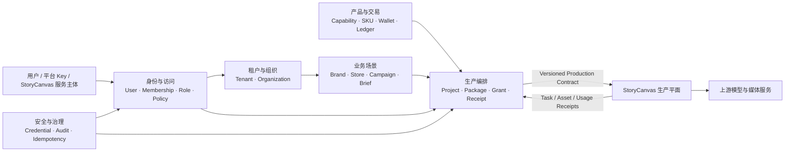

# C4 CONTROL PLANE ARCHITECTURE v0.1

> 状态：`PROPOSAL / READY_FOR_C0_REVIEW`  
> Owner：C4 · SaaS 平台与数据架构负责人  
> 日期：2026-07-30  
> 适用阶段：Program Gate T0  
> 公共合同基线：`docs/program/INTEGRATION_CONTRACT.md` v0.1（本提案不修改公共合同）

## 0. 结论

控制平面首版应是一个**模块化单体**，而不是微服务集合。它以 Tenant 作为数据隔离边界，以 Organization 表达商业组织，以 Project 作为一次视频生产工作的控制平面聚合根，通过版本化 `ProjectProductionPackage` 和短期项目令牌连接 StoryCanvas。StoryCanvas 只回传任务、资产和用量事实，不读取客户价格、不写钱包；SaaS 不读取 StoryCanvas SQLite。

现有前端 `DemoWorkspace + Zustand + mockApi + LocalStorage` 可以保留为 Demo Adapter。商业 MVP 再把同一应用端口切换到控制平面 HTTP API，不复制第二套海底捞主数据。

## 1. 权威基线、标记与边界

### 1.1 事实来源

按优先级使用：

1. `COMMON_MEMORY.md`
2. `GLOSSARY.md`
3. `ARCHITECTURE.md`
4. `ROLE_BOUNDARIES.md`
5. `ROLE_WORKBENCHES.md`
6. `INTEGRATION_CONTRACT.md` v0.1
7. C4 招聘说明与首轮任务书
8. Gate 2 代码和历史冻结协议

截至 2026-07-30，`docs/program/threads/C1` 与 `docs/program/threads/C3` 仍为 `NOT_STARTED`，权威资料库中没有可吸收的 C1/C3 新提案。因此：

- 本文不冻结组织层级、成员角色和渠道数据范围的业务语义。
- 本文不冻结额度单位、钱包、账本、价格、成本和结算语义。
- 依赖 C1/C3 的字段逐项标为 `PROPOSED(C1)` 或 `PROPOSED(C3)`。
- `PROPOSED(C4)` 表示 C4 可供评审的技术选择，不等于公共合同。
- 未标 `PROPOSED` 的标识和原则来自现有共同记忆或公共合同。

### 1.2 C4 负责

- 控制平面模块边界、聚合根和数据隔离。
- tenant / organization / project 的授权落地方式。
- 控制平面 API 草案与统一错误、审计、幂等规范。
- 项目生产包、短期项目令牌、生产回执接收端。
- 上游 Key 托管元数据、下游平台 Key 和安全边界。
- Demo 到商业 MVP 再到生产的迁移路径。

### 1.3 C4 不负责

- 定义客户售价、批发价、额度换算、账本动作或结算算法。
- 决定渠道层级、组织退出/转移、具体角色权限业务规则。
- 重构 StoryCanvas 画布、连续性、生成器或时间线。
- 把 StoryCanvas SQLite 当作 SaaS 集成接口。
- 修改公共 `INTEGRATION_CONTRACT.md` 或 C1/C3/C5 的线程记忆。

## 2. 现有前端盘点

### 2.1 代码资产

| 层 | 当前文件 | 当前能力 | 控制平面缺口 | 保留策略 |
|---|---|---|---|---|
| Domain | `src/domain/types.ts` | `DemoWorkspace` 聚合 Project、Brief、Brand、Script、Storyboard、Asset、Timeline | 无 tenant、organization、membership、capability、授权、任务/用量回执、审计、版本并发 | 保留 Gate 2 类型；通过 Adapter 映射，不原地重写 |
| Constants | `src/domain/constants.ts` | `demo-local-001`、路由、状态标签、LocalStorage key | 无合同版本、租户上下文和控制平面状态 | 保留现有 Demo 常量 |
| Selectors | `src/domain/selectors.ts` | 活跃脚本、镜头、事实 ID 和工作区指标 | 只支持单工作区，无数据范围过滤 | Demo 继续使用；真实权限必须由服务端执行 |
| Store | `src/stores/projectStore.ts` | 单一 Zustand Store；hydrate 与 Brief/Brand/Script/Storyboard/Timeline 更新 | 无会话、组织切换、tenant 隔离、授权决策、乐观锁、回执状态 | 保留为 Demo UI Store；MVP 增加 API client/query cache，不让 Store 成为权限源 |
| Service | `src/services/mockApi.ts` | 约 280ms 延迟，读取整份工作区并整体持久化 | 无 HTTP、鉴权、幂等、审计、分页、并发控制 | 抽象为 `ControlPlanePort` 的 Demo Adapter |
| Storage | `src/services/storage.ts` | `videoagent:mvp:v1` LocalStorage JSON | 浏览器可读写，无隔离、加密、迁移与并发 | 只用于 Demo；不得保存任何密钥或真实生产令牌 |
| Mock | `src/mocks/demoWorkspace.ts` | 海底捞三里屯统一主数据；3 版脚本、8 镜、8 素材、时间线和 QA | 无商业组织、钱包、生产授权和回执 | 继续作为唯一 Demo 主数据，不复制第二套 |

### 2.2 当前聚合的真实含义

现有 `DemoWorkspace` 是一个前端页面快照，不是未来数据库聚合，也不是跨平面合同：

```text
DemoWorkspace
├── project
├── brief
├── brand
├── scripts[] + activeScriptId
├── storyboard[]
├── assets[]
└── timeline
```

它适合 Gate 2 演示，但存在四个不可带入生产的性质：

1. 整份 JSON 可被浏览器直接覆盖。
2. Project、Brand、Script、Shot、Asset 的生命周期没有独立并发版本。
3. `owner` 是展示字符串，不是主体或成员标识。
4. 所有写操作默认拥有全量权限。

### 2.3 兼容映射

| Gate 2 字段 | 控制平面/生产合同映射 | 说明 |
|---|---|---|
| `project.id` | `projectId` | 保留 `demo-local-001` 作为 Demo 固定 ID |
| `brief` | `creativeBriefSnapshot` | 发包时快照化 |
| `brand.facts` | `brandFactsSnapshot` | Claim `C1—C8` 保留；不要与员工编号混作实体类型 |
| `brand.prohibitedWords` | `riskRulesSnapshot.prohibitedWords` | 发包后不随源数据静默变化 |
| `activeScriptId` + script | `approvedScriptVersion` | 当前代码没有“批准”状态；发包前需显式校验 |
| `storyboard` | `shotDrafts` | 生产平面可形成后续版本，不回写覆盖历史包 |
| `assets` | `referenceBindings` / AssetReceipt | 现有 Asset 缺 provenance、checksum、rights 等字段 |
| `timeline` | 生产平面内部对象 | 不作为控制平面首发包的权威时间线 |

## 3. 领域上下文



边界说明：

- “产品与交易”在同一控制平面部署，但业务语义由 C2/C3 拥有。
- “租户与组织”的层级和角色语义由 C1 拥有；C4 只提供隔离、策略执行和引用约束。
- “生产编排”只负责创建一致快照、签发授权、接收事实和调用 C3 的计量端口。
- 首版这些上下文是一个后端中的模块和数据库 schema，不是独立微服务。

## 4. 聚合根与不变量

| 聚合根 | 关键子对象 | C4 不变量 | 语义状态 |
|---|---|---|---|
| Tenant | settings、status | 所有租户业务数据必须带 `tenantId`；跨租户访问默认拒绝 | Tenant 是冻结概念 |
| Organization | parent link、membership references | 属于一个 tenant；组织树无环；服务端计算可见范围 | 层级/type/转移规则 `PROPOSED(C1)` |
| Identity / Membership | user、organization membership、role bindings | 同一用户可加入多组织；请求必须显式选择当前组织上下文 | role/scope `PROPOSED(C1)` |
| Brand | Store、Claim、Rule references | Brand/Store 不是 Tenant；事实和规则可版本化 | 已冻结原则 |
| Project | Campaign/Brief refs、approved script ref、status、version | 属于一个 tenant 和 organization；发包前上下文完整；每次修改递增版本 | 业务状态扩展 `PROPOSED(C2)` |
| ProductionPackage | immutable snapshot、content digest | 创建后不可原地覆盖；重发生成新 `packageVersion` | C4 提案 |
| ProductionGrant | scopes、capabilities、expiry、revocation | 限定 tenant/project/capability/expiry；不含上游 Key | 已冻结最小约束 |
| ProductionReceiptInbox | task/asset/usage receipts | 原始事实 append-only；同一幂等键不重复产生副作用 | C4 提案 |
| PlatformCredential | key metadata、secret hash、scopes | 明文只在创建时返回一次；库中只存 hash/secret reference | C4 提案 |
| ProviderCredential | provider metadata、secret reference | 上游 Key 永不进入浏览器、生产包、日志和回执 | 已冻结原则 |
| AuditStream | AuditEvent | 追加写；敏感值只记录摘要或脱敏结果 | C4 提案 |

不把以下对象设计为独立服务：

- 幂等记录是基础设施表，不是“幂等服务”。
- 审计是共享写入端口和追加表，不是首版“审计微服务”。
- ProductionPackage 与 Grant 是 Project 模块的子域，不单独部署。

## 5. 数据字典 v0.1

### 5.1 通用字段

| 字段 | 类型 | 约束 |
|---|---|---|
| `id` | string | 不透明、全局唯一；`PROPOSED(C4)` 真实环境使用 UUIDv7/ULID，Demo 可保留语义 ID |
| `tenantId` | string | 非平台级记录必填；查询和唯一索引必须包含 |
| `organizationId` | string | 业务归属组织；不得用它替代 tenant |
| `version` | integer | 从 1 递增，用于乐观并发和快照来源 |
| `createdAt` / `updatedAt` | RFC 3339 UTC | 服务端生成 |
| `createdBy` / `updatedBy` | principal ID | 服务端从认证上下文写入 |
| `correlationId` | string | 串联请求、审计、任务和账本动作 |

### 5.2 Tenant / Organization / Membership

| 字段 | 类型 | 状态与说明 |
|---|---|---|
| `tenantId` | string | 已冻结共同标识 |
| `tenant.status` | enum | `PROPOSED(C1)`：`active/suspended/closed` |
| `organizationId` | string | 已冻结共同标识 |
| `organization.type` | enum | `PROPOSED(C1)`：platform/channel/enterprise 等最终枚举由 C1 决定 |
| `organization.parentOrganizationId` | string? | `PROPOSED(C1)`：渠道组织树的直接父节点 |
| `organization.path` | string/array | `PROPOSED(C1/C4)`：服务端维护的祖先路径，用于数据范围查询 |
| `membershipId` | string | `PROPOSED(C1)` |
| `membership.roleCodes[]` | string[] | `PROPOSED(C1)` |
| `membership.dataScope` | object | `PROPOSED(C1)`：组织/门店/项目范围 |
| `membership.status` | enum | `PROPOSED(C1)` |

### 5.3 Project

| 字段 | 类型 | 说明 |
|---|---|---|
| `projectId` | string | 冻结共同标识 |
| `tenantId` | string | 隔离边界 |
| `organizationId` | string | 项目拥有组织 |
| `brandId` / `storeId` / `campaignId` | string? | 共同标识；引用必须同 tenant |
| `agentTemplateCode` | string | 场景 Agent 类型 |
| `creativeBriefVersion` | integer | 被发包的 Brief 版本 |
| `approvedScriptVersionId` | string | 发包前必填 |
| `status` | string | Gate 2 状态保留；生产状态细化 `PROPOSED(C2/C5)` |
| `version` | integer | 控制平面并发版本 |

### 5.4 ProductionPackage

| 字段 | 类型 | 说明 |
|---|---|---|
| `packageId` | string | 包实例标识 |
| `packageVersion` | integer | 同一 project 单调递增 |
| `contractVersion` | string | 首版 `0.1` |
| `tenantId` / `organizationId` / `projectId` | string | 强制上下文 |
| `brandId` / `storeId` / `campaignId` | string? | 业务引用 |
| `agentTemplateCode` | string | 场景 Agent 类型 |
| `creativeBriefSnapshot` | object | 创建时快照 |
| `brandFactsSnapshot` | object[] | 事实及来源快照 |
| `riskRulesSnapshot` | object | 禁用词、引用和风险规则 |
| `approvedScriptVersion` | object | 已批准脚本不可变快照 |
| `shotDrafts` | object[] | 初始镜头、比例、时长和平台 |
| `capabilityGrants[]` | object[] | capability code 与约束；不含供应商 Key |
| `authorizationConstraints` | object | 令牌 audience/scope/TTL 约束；不保存实际 access token |
| `sourceVersions` | object | Project/Brief/Brand/Script 的源版本 |
| `contentDigest` | string | 规范化 JSON 的 SHA-256 |
| `idempotencyKey` | string | 创建请求幂等键 |
| `createdAt` / `expiresAt` | datetime | 包过期不等于历史删除；TTL `PROPOSED(C4)` |

### 5.5 GenerationTaskReceipt

| 字段 | 类型 | 说明 |
|---|---|---|
| `generationTaskId` / `projectId` / `shotId` | string | 公共合同必填 |
| `tenantId` | string | 从令牌和任务绑定校验，不信任裸请求 |
| `taskType` | string | 公共合同概念；枚举 `PROPOSED(C5)` |
| `provider` / `model` | string | 事实元数据，不含密钥 |
| `status` | string | 枚举 `PROPOSED(C5)`；必须能区分非终态、成功、失败与取消 |
| `progress` | number? | 0—100；非终态可回传 |
| `inputDigest` | string | 输入摘要/哈希，不强制回传完整提示词 |
| `referenceAssetIds[]` | string[] | 共同资产标识 |
| `estimatedCost` / `actualCost` | object? | `PROPOSED(C3)`：金额、币种、小数位与可见性 |
| `meteringUnit` | string? | `PROPOSED(C3)` |
| `outputAssetIds[]` | string[] | 成功结果；单数公共合同向后兼容 |
| `error` | StandardError? | 标准化错误，不含供应商密钥和原始敏感响应 |
| `createdAt` / `startedAt` / `completedAt` | datetime? | 公共合同要求 |
| `idempotencyKey` | string | 必填 |

### 5.6 UsageReceipt

`UsageReceipt` 是生产事实，不是账本流水；控制平面验证、去重后再调用 C3 计量端口。

| 字段 | 类型 | 说明 |
|---|---|---|
| `usageRecordId` | string | 公共合同共同标识；全局唯一 |
| `tenantId` / `organizationId` / `projectId` | string | 强制上下文 |
| `generationTaskId` | string | 关联任务 |
| `capabilityCode` | string | 与项目授权交集校验 |
| `provider` / `model` | string | 实际执行事实 |
| `meterCode` | string | `PROPOSED(C3)` |
| `quantity` | decimal string | `PROPOSED(C3)`；JSON 不传浮点数 |
| `unit` | string | `PROPOSED(C3)` |
| `estimatedProviderCost` | money? | `PROPOSED(C3)` |
| `actualProviderCost` | money? | `PROPOSED(C3)` |
| `billingDisposition` | string | `PROPOSED(C3)`：consume/release/manual_review 等 |
| `reservationReference` | string? | `PROPOSED(C3)`；不得假设就是账本 ID |
| `occurredAt` | datetime | 供应商用量发生时间 |
| `reportedAt` | datetime | 生产平面回报时间 |
| `evidenceDigest` | string | 原始计量证据摘要 |
| `idempotencyKey` | string | 必填 |

## 6. 授权模型

### 6.1 请求上下文

每个服务端请求形成不可由业务 body 覆盖的 `AuthorizationContext`：

```text
principal
  + tenantId
  + activeOrganizationId
  + role/policy bindings
  + data scopes
  + purchased capability entitlements
  + target project ownership
  = decision
```

校验顺序：

1. 认证主体有效。
2. 主体对 `tenantId` 有有效成员关系或服务授权。
3. `activeOrganizationId` 属于 tenant 且在主体数据范围内。
4. 目标 Project 的 tenant 与 organization 可见。
5. action 被角色/策略允许。
6. 所购 Capability 允许执行该生产动作。
7. 计费动作通过 C3 端口完成预冻结；失败则不签发可计费任务授权。

前端菜单隐藏只改善体验，不能替代上述服务端判定。

### 6.2 三层范围

| 范围 | 用途 | 规则 |
|---|---|---|
| Tenant | 数据库隔离、唯一约束、审计和密钥归属 | 必选且默认拒绝跨 tenant |
| Organization | 组织树、成员身份、价格表/数据范围归属 | 具体层级语义 `PROPOSED(C1)` |
| Project | 单次生产授权和数据最小化 | 生产平面令牌只允许一个 project |

### 6.3 权限命名草案

以下是技术命名 `PROPOSED(C1/C4)`，业务角色到权限的映射由 C1 冻结：

```text
tenant.read
organization.read
membership.manage
project.read
project.update
project.package.create
production.grant.issue
production.receipt.write
credential.platform.manage
audit.read
```

### 6.4 短期项目令牌

`PROPOSED(C4)` 使用非对称签名 JWT；若撤销实时性要求高，可改为不透明令牌 + introspection，合同语义不变。

最小 claims：

```json
{
  "iss": "videoagent-control-plane",
  "aud": "storycanvas-production-plane",
  "sub": "service-or-user-principal-id",
  "jti": "grant-id",
  "tenant_id": "tenant-id",
  "organization_id": "organization-id",
  "project_id": "demo-local-001",
  "package_id": "package-id",
  "package_version": 1,
  "capabilities": ["video.generate"],
  "scopes": ["production.package.read", "production.receipt.write"],
  "contract_version": "0.1",
  "iat": 0,
  "nbf": 0,
  "exp": 0
}
```

规则：

- TTL `PROPOSED(C4)` 为 5—15 分钟；刷新必须重新做成员、项目和 Capability 校验。
- 令牌不含客户价格、余额、供应商路由策略或上游 Key。
- 浏览器只在进入生产平面时取得一次短期授权；不得写 LocalStorage。
- StoryCanvas 校验签名、issuer、audience、expiry、project、capability 和 package version。
- 高风险撤销写入短期 deny list；正常撤销依靠短 TTL。
- 生产回执必须同时满足 token scope 和服务端任务绑定，不能只凭 body 中的 `tenantId`。

## 7. API 草案

### 7.1 通用约定

- Base path：`/api/control-plane/v1`
- JSON 字段使用 camelCase。
- 时间使用 RFC 3339 UTC；十进制数量用字符串。
- 写请求使用 `Idempotency-Key`；更新聚合使用 `If-Match`/version。
- 响应带 `X-Request-Id`、`X-Correlation-Id`。
- 列表使用 opaque cursor，不暴露数据库 offset。
- 所有接口先鉴权再按 tenant 过滤；禁止“先查全局 ID 再判断”。

标准错误：

```json
{
  "error": {
    "code": "PROJECT_SCOPE_DENIED",
    "message": "Project is outside the active authorization scope.",
    "retryable": false,
    "details": {},
    "requestId": "request-id",
    "correlationId": "correlation-id"
  }
}
```

错误类：

| HTTP | code 示例 | 含义 |
|---|---|---|
| 400 | `CONTRACT_VALIDATION_FAILED` | 字段或合同版本无效 |
| 401 | `TOKEN_INVALID` | 未认证或令牌无效 |
| 403 | `PROJECT_SCOPE_DENIED` | 无 tenant/org/project 权限 |
| 404 | `PROJECT_NOT_FOUND` | 不泄露其他 tenant 对象是否存在 |
| 409 | `IDEMPOTENCY_CONFLICT` / `VERSION_CONFLICT` | 同 key 不同请求或版本冲突 |
| 422 | `CAPABILITY_NOT_ENTITLED` | 已认证但能力不可用 |
| 429 | `RATE_LIMITED` | 平台 Key/主体限流 |
| 503 | `METERING_TEMPORARILY_UNAVAILABLE` | 可重试依赖失败 |

### 7.2 创建项目生产包

`POST /projects/{projectId}/production-packages`

Headers：

```text
Authorization: Bearer <user-session-or-platform-key>
Idempotency-Key: <opaque-key>
If-Match: "<project-version>"
```

请求：

```json
{
  "approvedScriptVersionId": "script-a",
  "requestedCapabilities": ["video.generate"],
  "contractVersion": "0.1"
}
```

响应 `201`：

```json
{
  "package": {
    "packageId": "ppk_...",
    "packageVersion": 1,
    "contractVersion": "0.1",
    "tenantId": "ten_...",
    "organizationId": "org_...",
    "projectId": "demo-local-001",
    "agentTemplateCode": "local_store",
    "creativeBriefSnapshot": {},
    "brandFactsSnapshot": [],
    "riskRulesSnapshot": {},
    "approvedScriptVersion": {},
    "shotDrafts": [],
    "capabilityGrants": [],
    "authorizationConstraints": {
      "audience": "storycanvas-production-plane",
      "scopes": [
        "production.package.read",
        "production.receipt.write"
      ],
      "maxTtlSeconds": 900
    },
    "sourceVersions": {},
    "contentDigest": "sha256:...",
    "idempotencyKey": "package-command-key",
    "createdAt": "2026-07-30T00:00:00Z",
    "expiresAt": "2026-08-06T00:00:00Z"
  },
  "authorization": {
    "grantEndpoint": "/api/control-plane/v1/projects/demo-local-001/production-grants",
    "tokenIssued": false
  }
}
```

这里把“包内容”和“短期授权”放在同一交付 envelope 中满足公共合同语义，但不把会过期的 access token 写入不可变包快照。调用方随后通过 grant endpoint 签发或刷新令牌；Demo Adapter 可以在同一步模拟二者。

服务端原子步骤：

1. 锁定/校验 Project 版本与上下文。
2. 校验脚本批准状态和 Capability。
3. 生成不可变快照与 digest。
4. 记录审计和 outbox event。
5. 返回包；不在此响应中暴露上游 Key。

### 7.3 签发短期项目令牌

`POST /projects/{projectId}/production-grants`

请求：

```json
{
  "packageId": "ppk_...",
  "requestedCapabilities": ["video.generate"],
  "requestedScopes": [
    "production.package.read",
    "production.receipt.write"
  ]
}
```

响应 `201`：

```json
{
  "grantId": "grt_...",
  "tokenType": "Bearer",
  "accessToken": "<returned-once>",
  "expiresAt": "2026-07-30T00:15:00Z",
  "projectId": "demo-local-001",
  "packageId": "ppk_...",
  "capabilities": ["video.generate"],
  "scopes": [
    "production.package.read",
    "production.receipt.write"
  ]
}
```

签发前调用 C3 预冻结端口的时机与粒度为 `PROPOSED(C3)`：按项目、按批次还是按生成任务必须由 C3 冻结。C4 建议最终在“创建可计费 GenerationTask”时预冻结，不在单纯查看生产包时冻结。

### 7.4 读取生产包

`GET /production-packages/{packageId}`

- 允许用户会话、受限平台 Key 或短期项目令牌访问。
- 项目令牌的 `project_id/package_id` 必须与路径一致。
- 支持 `If-None-Match: <contentDigest>`。

### 7.5 接收任务回执

`PUT /production-receipts/generation-tasks/{generationTaskId}`

使用 `PUT` 表达同一任务事实的可重放 upsert；状态只能按允许的状态机前进，终态不可被较旧回执覆盖。

请求：

```json
{
  "contractVersion": "0.1",
  "tenantId": "ten_...",
  "projectId": "demo-local-001",
  "shotId": "shot-01",
  "taskType": "video.generate",
  "provider": "provider-code",
  "model": "model-code",
  "status": "succeeded",
  "progress": 100,
  "inputDigest": "sha256:...",
  "referenceAssetIds": [],
  "estimatedCost": null,
  "actualCost": null,
  "meteringUnit": null,
  "outputAssetIds": ["ast_..."],
  "error": null,
  "createdAt": "2026-07-30T00:00:00Z",
  "startedAt": "2026-07-30T00:00:01Z",
  "completedAt": "2026-07-30T00:00:20Z",
  "idempotencyKey": "task-receipt-key"
}
```

响应：

```json
{
  "accepted": true,
  "generationTaskId": "task-id",
  "receiptVersion": 3,
  "duplicate": false,
  "nextAction": "await_usage_receipt"
}
```

`nextAction` 枚举为 `PROPOSED(C3/C5)`。

### 7.6 接收用量回执

`PUT /production-receipts/usage/{usageRecordId}`

响应先表示“事实已接收”，不承诺同步完成客户额度结算：

```json
{
  "accepted": true,
  "usageRecordId": "usage-id",
  "duplicate": false,
  "meteringStatus": "pending"
}
```

`meteringStatus`、reservation/consume/release 的映射和账本引用均为 `PROPOSED(C3)`。推荐处理顺序：

1. 验证令牌、tenant/project/task/capability 绑定。
2. 用 `usageRecordId + idempotencyKey` 去重。
3. append 原始 UsageReceipt。
4. 同事务写 outbox。
5. 异步调用 C3 计量模块。
6. C3 产生 append-only 账本动作；C4 不直接改余额。

### 7.7 AssetReceipt

公共合同已要求 AssetReceipt。`PROPOSED(C4/C5)` 接口为：

`PUT /production-receipts/assets/{assetId}`

字段完全遵守 `INTEGRATION_CONTRACT.md`，存储引用必须是对象存储 key/URI 或受控本地引用，不接受 SaaS 直接读取 StoryCanvas SQLite 文件路径。

## 8. Key、审计与幂等

### 8.1 上游 Provider Key

```text
ProviderCredential metadata (DB)
  provider / environment / tenant scope? / status / version / secretRef
                                      |
                                      v
                       Secret Manager / KMS encrypted secret
                                      |
                                      v
                     Server-side Provider Adapter only
```

规则：

- 首选云 Secret Manager；MVP 本地部署可用 KMS/主密钥信封加密，但密文与主密钥不得同库同权限。
- 数据库只保存 `secretRef`、版本、状态、创建/轮换时间和审计主体。
- 供应商适配器按最小权限在运行时读取，内存短暂缓存。
- Key 轮换采用“新增版本 → 健康检查 → 切换 → 撤销旧版”。
- 日志、错误、任务回执、生产包、浏览器和 LocalStorage 均不得出现明文。
- 不提交真实 Key，不用真实 Key 做本轮验证。

### 8.2 下游 Platform API Key

`PROPOSED(C4)` 结构：

```text
keyId
tenantId
organizationId
displayName
prefix
secretHash
scopes[]
projectConstraints[]
capabilityConstraints[]
expiresAt
lastUsedAt
status
rateLimitPolicyId
createdBy / rotatedFrom
```

- 明文只在创建时返回一次。
- 使用高熵随机 secret，库中保存带 pepper 的 HMAC/hash，不可反解。
- Key 前缀只用于识别，不用于认证。
- 默认 tenant/org 限定；可进一步限制 project、capability、来源 IP 和速率。
- 支持双 Key 滚动轮换、即时禁用和使用审计。
- Platform API Key 不能兑换或读取 Provider Key。

### 8.3 审计

每个安全或商业关键动作写 `AuditEvent`：

```text
auditEventId, occurredAt, tenantId, organizationId,
actorType, actorId, impersonatorId?,
action, targetType, targetId,
decision, reasonCode,
requestId, correlationId, traceId?,
sourceIp, userAgent,
beforeDigest?, afterDigest?,
metadata(redacted)
```

必须审计：

- 组织/成员/角色变化。
- 项目包创建、授权签发和撤销。
- Platform Key 创建、轮换、禁用和认证失败。
- Provider Key 元数据变化和服务端读取。
- 任务/资产/用量回执接收、拒绝和重复。
- C3 计量调用结果、人工重放和异常处理。
- 管理员跨范围或 break-glass 操作。

审计中不保存令牌、完整提示词、原始 Key、支付敏感值或供应商原始错误体。

### 8.4 幂等

`PROPOSED(C4)` 幂等记录键：

```text
(tenantId, authenticatedPrincipalId, operation, idempotencyKey)
```

记录：

- request canonical hash
- resource ID
- response status/body digest 或可重建引用
- processing/completed/failed 状态
- firstSeenAt / expiresAt

规则：

1. 同 key + 同请求返回第一次结果，标记 duplicate。
2. 同 key + 不同请求返回 `409 IDEMPOTENCY_CONFLICT`。
3. `usageRecordId`、`generationTaskId` 同时是业务唯一键，幂等键不能替代业务唯一约束。
4. 业务写入、审计和 outbox 在一个数据库事务中提交。
5. 消费 outbox 至少一次投递，消费者仍按业务 ID 去重。
6. 幂等保留期 `PROPOSED(C4)`：普通命令至少 24 小时；财务/用量事实按审计保留策略长期保存。

## 9. 数据隔离与存储

商业 MVP 推荐：

- 一个控制平面后端部署。
- 一个 PostgreSQL 集群，按模块划分 schema。
- 所有 tenant 表包含 `tenant_id`，复合唯一键与索引以 `tenant_id` 开头。
- Repository 层强制注入 tenant context；高风险表可叠加 PostgreSQL RLS。
- 对象存储保存生产包大快照、资产和导出物；数据库保存版本、digest 和 object key。
- Secret Manager/KMS 保存上游凭证。
- Outbox 表承接可靠异步工作；首版可由同进程 worker 消费。

禁止：

- 通过前端传入 `tenantId` 决定授权。
- 用全局可猜 ID 绕开 tenant 过滤。
- 把一份租户数据库复制给 StoryCanvas。
- SaaS 挂载并查询 StoryCanvas SQLite。
- 让生产平面成为钱包、价格或组织的事实源。

## 10. 演进路线

### 10.1 阶段 A：Demo Mock（当前）

目标：老板 10—15 分钟演示闭环。

- 保留 `DemoWorkspace`、Zustand、`mockApi` 和 `videoagent:mvp:v1`。
- 新增概念时优先建立纯 TypeScript contract/adapter，不改 Gate 2 主数据结构。
- 使用固定 Demo tenant/org 上下文 `PROPOSED(C1)`，只在 Adapter 内映射，不复制海底捞数据。
- 模拟 package/grant/receipt/usage 状态，但字段名和错误语义与 v0.1 一致。
- Demo token 只能是内存中的非秘密模拟对象，清楚标记 Demo Mode。
- 不接真实供应商 Key，不运行资金结算。

退出条件：

- 黄金路径能展示发包、进入 StoryCanvas、回执、额度状态解释。
- 失败、权限不足、能力禁用和余额不足都有一致错误。
- C1/C3/C5 对公共字段完成评审。

### 10.2 阶段 B：商业 MVP

目标：少量真实租户和受控生产。

- 建立模块化单体：IAM/Org、Marketing/Project、Catalog/Metering adapter、Production integration、Security/Audit。
- PostgreSQL + 对象存储 + Secret Manager。
- 真实服务端 session、Platform API Key、短期项目令牌和 JWKS。
- 不可变 ProductionPackage；StoryCanvas 通过 HTTPS API 拉包和回传。
- 用量 Inbox + transactional outbox + 同进程 worker。
- C3 模块完成 reserve/consume/release，C4 只调用端口。
- 供应商适配仍在生产平面服务端，客户不可见上游 Key。
- 增加合同测试、权限负向测试、回执重放和账本对账证据。

退出条件：

- 跨租户访问测试为拒绝。
- 每个用量事实可追到 task、asset、project、reservation/ledger action。
- Key 可轮换，审计可查询，幂等重放不重复扣减。
- 不依赖 StoryCanvas SQLite 集成。

### 10.3 阶段 C：生产强化

仅在容量、隔离或团队边界出现证据后演进：

- 独立可靠队列和 dead-letter/replay 工具。
- 多区域对象存储、灾备、密钥自动轮换和细粒度 KMS policy。
- 任务、用量与审计的可观测性、SLO 和告警。
- 高量模块可按边界拆分部署，但优先保持合同稳定。
- 对高风险管理员操作增加双人审批和 break-glass 复核。
- API 客户控制台、Webhook 签名、配额和细粒度限流。

明确不以“生产阶段”为理由自动拆成租户服务、审计服务、幂等服务、Key 服务等复杂微服务。

## 11. 迁移顺序

1. C0 审核本提案；C1/C3/C5 回答 Request。
2. 冻结 v0.1 的组织引用、计量字段、任务状态和标准错误。
3. 定义 `ControlPlanePort`，让现有 `mockApi` 成为 Demo Adapter。
4. 在 Mock 中演示 package/grant/task receipt/usage receipt，不改变现有主数据来源。
5. 建立商业 MVP 模块化单体和数据库迁移。
6. 将前端 Store 从整份 LocalStorage 写入切到 API/query cache；LocalStorage 只保留非敏感 UI 偏好。
7. StoryCanvas 通过合同 Adapter 接入；用 contract fixtures 和重放验证。
8. 真实小流量启用供应商、用量和账本闭环。

回滚原则：

- 新 API 可通过 adapter feature flag 关闭，回到 Demo Mock。
- 生产包和回执 append-only，不通过删除历史“回滚”。
- 数据迁移采用 expand/migrate/contract，不原地破坏 Gate 2 数据。

## 12. 风险与待决

| 风险 | 影响 | 临时方案 |
|---|---|---|
| C1 组织/成员语义未冻结 | 授权字段可能返工 | 只冻结 tenant/org/project 三层校验原则，其余标 `PROPOSED(C1)` |
| C3 计量语义未冻结 | UsageReceipt 无法直接产生账本动作 | 原始回执先 append，结算异步；字段标 `PROPOSED(C3)` |
| C5 任务状态与错误未冻结 | 回执状态映射不稳定 | 保留 string code + contract version，写 REQ-C4-003 |
| Gate 2 Asset provenance 不足 | 无法满足生产审计 | 发包 Adapter 显式标缺失；商业 MVP 才强制校验 |
| 浏览器 LocalStorage 可篡改 | Demo 权限/余额不可作为真实证据 | 清楚标 Demo；MVP 全部服务端权威 |
| 同步结算耦合任务回执 | 依赖故障导致生产阻塞 | Inbox + outbox；回执接收与 C3 处理解耦 |

## 13. Requests

详细请求写入 `docs/program/threads/C4/REQUESTS.md`：

- `REQ-C4-001`：请 C1 冻结组织树、Membership、角色与数据范围语义。
- `REQ-C4-002`：请 C3 冻结 UsageReceipt 到 reserve/consume/release 的字段与状态映射。
- `REQ-C4-003`：请 C5 与 C0 确认任务/资产回执枚举、标准错误与项目令牌验证边界。

## 14. 验收自查

- [x] 已盘点现有 domain/store/service/mock。
- [x] 已绘制领域上下文并列出聚合根。
- [x] 已提出 tenant/organization/project 授权。
- [x] 已给出生产包、短期令牌、任务回执、用量回执 API 草案。
- [x] 已覆盖上游 Key、平台 Key、审计和幂等。
- [x] 已给出 Mock → 商业 MVP → 生产路线。
- [x] C1/C3 未冻结字段均显式标 `PROPOSED`。
- [x] 不读取 StoryCanvas SQLite，不设计复杂微服务。
- [x] 未修改公共合同、历史 Gate 代码或他人线程记忆。
