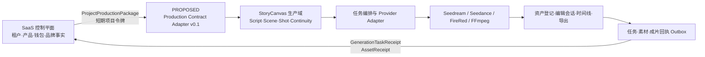

# C5 StoryCanvas 生产平面评估 v0.1

> 状态：`PROPOSED / WAITING_C0_REVIEW`
> 负责人：C5 StoryCanvas 与媒体生产引擎负责人
> 评估日期：2026-07-30（Asia/Shanghai）
> 合同基线：权威资料库 `INTEGRATION_CONTRACT.md` v0.1
> 代码基线：`b4295471825427fab248c10dd41884fdea31993d`
> 方法：只读源码、历史 Gate 和固定上游审计；本轮未运行测试、未调用模型、未启动服务。

## 1. 结论摘要

当前仓库不是空白原型，也不应重写。它已经形成四类可保留资产：

1. Toonflow 原有的项目、脚本、资产、分镜、生成和轨道基础。
2. 独立可维护的 StoryCanvas React 画布与专业交互。
3. `sc_*` 领域表、结构化连续性记忆、真实图片/视频任务和可信角色资产。
4. 固定版本的 FireRed-OpenStoryline 子模块与健康检查边界。

但当前成果仍是“本地单用户真实生成 Demo”，不是可由商业 SaaS 调用的完整生产平面。主要断点是：

- 新画布的脚本、镜头和锁定状态大多停留在 React 内存；只有输出设置写入 LocalStorage。
- 当前特殊项目由服务端自动创建为“南城咖啡”，与统一 Demo `demo-local-001 / 海底捞三里屯` 不一致。
- `ProjectProductionPackage` 没有入站接口、严格 Schema 或不可变快照。
- 生成任务有 SQLite 持久化和幂等键，但没有完整 `GenerationTaskReceipt`、成本事实、标准错误、回执 Outbox、取消/重试或可靠恢复。
- 普通镜头图片/视频输出没有统一登记为 `sc_media_assets`，因此不能形成完整 `AssetReceipt`。
- 连续性核心较完整，但当前数据是五镜头固定种子；连续性审核表尚未形成闭环，上一镜尾帧策略也未真正生成和登记尾帧资产。
- 时间线目前只有 Schema/表和 Toonflow 旧轨道基础；当前导出是 FFmpeg 顺序拼接，不创建时间线版本、编辑会话或导出资产记录。
- FireRed Adapter 只完成健康检查；会话、素材、自然语言命令、Artifact、时间线和导出映射尚未实现。
- 本地默认账号、明文密码、全局 SQLite、全局供应商密钥和缺少租户/项目令牌，使其不能直接作为多租户服务上线。

建议保留现有产品与 Gate 成果，在其外增加最小合同适配层；Demo、商业 MVP、完整媒体管线分三阶段推进。

## 2. 仓库、工作树与已有成果

### 2.1 当前状态

| 项目 | 状态 |
|---|---|
| 仓库 / 工作树 | `/Users/docfat/.codex/worktrees/19f7/短视频agent` |
| Git HEAD | `b4295471825427fab248c10dd41884fdea31993d` |
| 当前分支 | detached HEAD；同一提交也是主工作树 `feat/storycanvas-phase0` 当前头部 |
| 未提交改动（开工时） | 无 |
| FireRed gitlink | `04297707e7607dd398e906262235d0797068e7b4` |
| 本工作树 FireRed 子模块 | 未初始化；只读复核使用主工作树中同一固定提交 |
| 本轮代码动作 | 无；仅新增 C5 文档 |

### 2.2 必须保留的成果

按提交历史，当前基线已经包含：

- Phase 0：固定 FireRed 子模块、上游审计、健康检查和许可审计。
- Phase 1：统一模型配置、运行时密钥注入、供应商种子与模型诊断。
- Phase 2：StoryCanvas 领域 Schema、事务型 Migration 和安全媒体路径。
- StoryCanvas 前端：项目、脚本、画布、记忆、角色库、素材和设置七个入口；视觉 QA 已通过。
- 连续性：结构化实体、世界事件、镜头契约、镜头关系、批准引用和世界版本。
- 真实任务：Seedream 图片、BytePlus Seedance 视频、任务轮询、幂等键、失败提示和进程重启标记。
- 角色资产：Seedream / Image 2 角色设定板、BytePlus 资产组、TOS 中转、`asset://` 可信引用和实体绑定。
- 生成保护：已有图片重生成二次确认，旧任务结果仍保留。
- 导出：FFmpeg 将成功视频统一为 720×1280 / H.264 后顺序拼接。

历史提交和其他 worktree 中的连续性、角色绑定和章节修复成果均不得 reset、checkout、覆盖或整体重建。

## 3. C5 边界与明确不修改范围

### 3.1 C5 负责

- ScriptVersion、Scene、Shot 与分镜画布的生产侧表达。
- 角色、物品、场景、品牌引用和连续性记忆。
- 图片、视频、剪辑和导出任务。
- 供应商适配、媒体资产、编辑会话、时间线版本和导出物。
- 生产合同的 C5 侧适配提案、任务/资产/成片回执。

### 3.2 不进入本仓库

| 不应进入 StoryCanvas 的内容 | 正确 Owner / 位置 |
|---|---|
| Tenant、Organization、Membership、渠道层级 | C1/C4，SaaS 控制平面 |
| Product、SKU、PriceBook、Package、客户价格 | C2/C3，SaaS 控制平面 |
| Wallet、CreditLedger、充值、退款、分润、结算 | C3，SaaS 控制平面 |
| 客户余额判断、预冻结账本写入、消费/释放账本动作 | C3/C4，SaaS 控制平面 |
| 上游 API Key 下发给客户或前端 | 禁止；只留服务端供应商适配层 |
| 平台 API Key 生命周期和客户开发者控制台 | C4，SaaS 控制平面 |
| 品牌事实、禁用词、营销规则的权威编辑 | C2/C4；StoryCanvas 只消费项目快照 |
| 跨角色工作台、导航和老板演示总编排 | C6 |
| 公共 `INTEGRATION_CONTRACT.md` 的单方修改 | C4/C5 联合提案，C0 批准 |

本评估不会把上述对象复制进 StoryCanvas 形成第二套事实源。

## 4. 生产平面边界



边界原则：

- 控制平面决定“谁可做、买了什么、是否已预冻结”。
- StoryCanvas 决定“如何生产、引用什么、任务如何执行、形成什么媒体事实”。
- StoryCanvas 接收客户价格以外的生产授权，不计算或修改客户余额。
- FireRed 只作为技术执行器；其 session、media、Artifact 和节点结果不得直接成为业务 UI 合同。

## 5. 能力矩阵与分类

分类定义：

- **完整保留**：核心设计和实现可作为后续基线，不重写。
- **需要适配**：已有可用基础，但尚未满足跨仓合同或商业 MVP。
- **尚未完成**：只有 Schema、局部实现或计划，不能宣称闭环。
- **不应进入本仓库**：属于控制平面或其他岗位。

| 能力 | 当前证据 | 分类 | 最小处理 |
|---|---|---|---|
| 脚本 | Toonflow 有 `o_script` CRUD/导出；`sc_script_versions` 有 Schema 和表；新 React 脚本页可编辑章节、标题和提示词 | 需要适配 | 从 Package 导入批准脚本版本；画布修改保存为生产侧派生版本或显式草稿，不能只留 React 内存 |
| 分镜画布 | 独立 `frontend/` 源码、视觉 QA、镜头选择/拖动/锁定/生成/批量流程、旧 `o_agentWorkData/o_storyboard` 持久化入口 | 需要适配 | 保留视觉和交互；把新画布绑定到 `ScriptVersion/Scene/Shot` 与映射后的项目，不另造固定五镜头主数据 |
| 角色引用 | `sc_entities/sc_reference_bindings`、角色库、BytePlus 资产组、`asset://` 引用和可信绑定已实现 | 需要适配 | 保留可信引用路径；补项目包引用导入、权利状态、审核状态和供应商可移植性 |
| 场景/物品/品牌引用 | 连续性种子含 location/object/brand 和批准参考图 | 需要适配 | 从项目快照创建或更新实体；增加生产侧管理入口，去除“南城咖啡”固定种子依赖 |
| 连续性核心 | 结构化实体、世界事件、镜头契约、关系、引用、世界版本、生成前确定性编译与冲突拒绝 | 完整保留 | 作为生产域核心；泛化项目初始化，补审核结果和尾帧资产闭环 |
| 上一镜尾帧 | 合同限制只有 `continuous-action` 可开启；UI 和服务端规则已存在 | 尚未完成 | 实际提取/登记上一镜尾帧，作为有来源的 `MediaAsset/ReferenceBinding` 传递；普通切镜继续禁用 |
| 图片任务 | 服务端模型调用、幂等键、状态、轮询、生成图保护已实现 | 需要适配 | 统一任务 Schema，登记输出资产，补标准回执、成本、取消/重试和可靠恢复 |
| 视频任务 | BytePlus Seedance 创建/轮询/下载、可信人物引用、批量生成已实现 | 需要适配 | 避免配置漂移；补成本/计量、取消、恢复、资产登记和合同回执 |
| 任务中心 | `sc_tasks` 有状态、进度、输入/输出、错误、幂等、外部任务和成本列 | 需要适配 | 当前重启直接把旧任务置失败；需队列/恢复、标准错误、started/completed 时间、Receipt Outbox |
| Provider 抽象 | Toonflow 通用 Vendor 体系、模型角色配置、BytePlus 专用签名/视频/TOS Adapter | 需要适配 | 统一为服务端 Provider Registry；UI 只见能力；避免配置展示与实际调用模型不一致 |
| FireRed 接口 | 固定子模块；Web/MCP 三态健康检查已实现 | 尚未完成 | 实现 session/media/chat/cancel/preview/Artifact 映射；不让业务 UI 依赖 FireRed 内部 JSON |
| 素材资产 | `sc_media_assets` 含来源、Hash、技术元数据、Prompt、rightsNote；项目媒体路径有隔离和穿越防护 | 需要适配 | 普通镜头图片/视频和导出目前绕过资产表，必须统一登记并产生 `AssetReceipt` |
| 素材库 UI | 当前按 React 镜头状态聚合示例图和真实生成结果 | 需要适配 | 改读资产仓库；保留镜头定位体验；支持版本、审核和权利状态 |
| 编辑会话 | `sc_edit_sessions/sc_edit_commands` Schema 与表已存在 | 尚未完成 | 接入 FireRed session、命令历史、预览和失败恢复 |
| 时间线 | `TimelineVersion` Schema/表、Toonflow 旧 `o_videoTrack` 基础存在 | 尚未完成 | 选择一个生产事实源；将 FireRed Timeline 映射成不可变版本，旧轨道只经兼容层使用 |
| 导出 | 当前可将成功视频统一规格后按顺序拼接并返回 URL | 需要适配 | Demo 可保留；MVP 必须创建时间线版本、导出任务、导出资产、校验值和回执 |
| 连续性 QA | `sc_continuity_reviews` 表已建 | 尚未完成 | 生成后写入观察状态/问题；把阻塞性错误与警告纳入成片 QA |
| 多租户与商业计量 | 无租户上下文、项目令牌、钱包或账本写入 | 不应进入本仓库 | 只验证 C4 签发的短期项目令牌并回传用量事实 |

## 6. 关键实现观察

### 6.1 当前 React 工作台仍是 Demo 状态源

- `frontend/src/App.jsx` 以五个“南城咖啡”镜头常量初始化。
- 标题、脚本、时长、锁定、新增和删除镜头只更新 React state。
- 只有输出分辨率和默认时长写入 `storycanvas:output-settings` LocalStorage。
- 服务端 Bootstrap 只回填近期生成任务和连续性，不返回权威脚本/分镜。
- 新增镜头可创建 fallback 连续性契约，但不会同步到 `o_storyboard/sc_shot_metadata`。

因此视觉与交互应完整保留，数据接线必须重做为“Package → 生产项目 → ScriptVersion/Shot → UI”单向初始化和显式保存。

### 6.2 连续性设计方向正确

现有实现遵循共同记忆：

- 连续性是结构化世界记忆，不是无条件串联上一镜尾帧。
- 镜头声明读取实体、开始状态、状态变化、动作、摄影和切镜。
- 世界事件按顺序回放；生成前校验契约。
- 只有 `continuous-action` 可开启 `usePreviousEndFrame`。

这部分是最具差异化的生产资产，后续应泛化，不应替换。

### 6.3 任务有基础，但不是合同回执

当前 `sc_tasks` 已有：

- 任务 ID、项目、任务类型、供应商、状态、进度。
- 输入/输出/错误 JSON、幂等键、外部任务 ID。
- 估算和实际成本列。

但实际 MVP 任务未完整写入：

- `storyboardId/shotId` 的统一字段映射。
- `estimatedCost/actualCost` 和计量单位。
- `startedAt/completedAt`。
- 标准化错误类型和可重试性。
- 引用资产 ID 列表。
- 回调投递状态和 `usageRecordId`。

重启恢复目前将旧 queued/running 任务直接标记失败，不是真正恢复。

### 6.4 可信人物路径强，但供应商耦合高

视频生成对绑定人物镜头执行强校验，只有 `asset://` 可信人物引用才可进入 BytePlus Seedance。这能降低身份漂移和部分真人风控，但也带来约束：

- 本地上传图片即使绑定到人物实体，仍没有 `asset://`，视频生成会继续判定未绑定可信人物。
- Seedream / Image 2 角色设定板最终都依赖 BytePlus 资产组；Image 2 还依赖海外 TOS 中转。
- 项目级权利证明目前只是固定说明文本，不能代替真实授权和审核记录。

建议保留“可信引用门槛”，但把“可信”定义成可扩展的 Provider Capability，不永久等同于 BytePlus `asset://`。

### 6.5 当前导出不是时间线闭环

`mvpExport` 能读取每镜最新成功视频、用 FFmpeg 规范化并拼接，适合 Demo 降级路径。但它：

- 不创建 `GenerationTask` 类型的导出任务。
- 不创建 `EditSession/TimelineVersion`。
- 不登记 `MediaAsset`、Hash、时长、权利和审核状态。
- 不包含字幕、音频、转场、旁白或自然语言修改。
- 不回传 `AssetReceipt` 或可重放的时间线。

所以“顺序合并成功”不能等同于“完整媒体管线已完成”。

## 7. 对照 v0.1 集成合同的缺口

| 合同项 | 当前情况 | 结论 |
|---|---|---|
| 共同标识 | 当前核心 FK 多为 Toonflow 正整数；控制平面 `demo-local-001` 等是外部字符串语义 | 必须用映射层，不修改现有整数主键 |
| `ProjectProductionPackage` | 无入站接口、Schema、合同版本、幂等键或不可变快照；当前自动创建“南城咖啡”项目 | 缺失 |
| 项目与租户上下文 | StoryCanvas 无 tenant/org 上下文 | 只存授权快照与外部 ID，不建设租户域 |
| 品牌事实/规则快照 | 当前写死在 Demo/连续性种子 | 必须从 Package 消费 |
| 已批准脚本版本 | 有领域 Schema/表，但当前 MVP UI 未使用 | 需要接线 |
| 镜头初稿/比例/平台/时长 | 当前前端常量具备字段，服务端缺统一导入 | 需要接线 |
| 可用能力与短期授权 | 只检查全局模型 Key；没有项目能力令牌 | 缺失 |
| `GenerationTaskReceipt` | `sc_tasks` 可提供部分字段 | 缺成本/单位/标准错误/引用资产/时间/投递 |
| `AssetReceipt` | `sc_media_assets` Schema 接近；角色资产落表 | 普通图片、视频和导出未统一落表 |
| 额度状态机 | 无 reserve/consume/release，且不应在本仓库实现账本 | 仅接受预冻结证明并回传任务结果 |
| 项目令牌 | 只有本地 JWT 和默认管理员 | 缺失 |
| 上游 Key 服务端隔离 | 当前前端看不到 Key 值，配置只报告是否可用 | 可保留，但需安全存储/轮换 |
| Demo Adapter | 当前字段名和主数据与统一 Demo 不一致 | 必须改用同一 Package fixture |

## 8. PROPOSED 最小适配层

以下是 C5 提案，不代表公共合同已批准。

### 8.1 `ProductionContractAdapterV01`

职责：

1. 严格校验 `ProjectProductionPackage` 和 `contractVersion=v0.1`。
2. 验证 C4 签发的短期项目令牌：至少限定 `tenantId/projectId/capability/expiry`。
3. 以 `idempotencyKey` 幂等导入。
4. 使用 `sc_external_mappings` 维护外部字符串 ID 与内部 Toonflow/sc ID 的映射。
5. 保存不可变 Package 快照；后续更新只能创建新版本。
6. 将批准脚本、Scene/Shot、引用和规则投影到现有生产域。

建议新增的生产侧持久化仅限：

- `sc_production_packages`：合同版本、外部项目 ID、包版本、幂等键、快照、接收时间。
- `sc_receipt_outbox`：回执类型、聚合 ID、载荷、投递状态、重试次数和时间。

不得在这些表中复制钱包余额、客户价格或渠道关系。

### 8.2 ID 映射

建议映射键：

```text
system = "saas-control-plane"
entityType = project | script-version | scene | shot | asset | generation-task | timeline-version
localId = StoryCanvas 内部 ID
externalId = 合同共同标识
```

内部 `o_project/o_storyboard` 整数 ID 保留，避免破坏历史 Toonflow 路由和 Gate 成果。

### 8.3 任务与计量边界

任务创建前：

- 控制平面完成 `reserved`。
- StoryCanvas 只验证令牌能力和一个不透明的预冻结/授权关联，不读取客户价格。

任务结束后：

- 成功且形成可交付资产：发出 `GenerationTaskReceipt(status=succeeded)` 和 `AssetReceipt`。
- 供应商失败、提交失败或取消：发出标准失败回执，由控制平面执行 `released`。
- 超额或补差由控制平面创建新账本动作，StoryCanvas 不覆盖任何商业流水。

### 8.4 资产统一登记

所有图片、视频、预览、字幕、音频和导出都应先进入 `sc_media_assets`，再回传 `AssetReceipt`。Demo 阶段可把 `shotId/taskId/version` 写入 `metadataJson`；商业 MVP 应增加显式的资产—镜头/任务关系表，避免长期依赖 JSON 查询。

### 8.5 FireRed Adapter

按现有固定提交，FireRed 原生提供：

- Session 创建/读取/清理/取消。
- 普通及分片媒体上传、pending 媒体、缩略图和文件读取。
- WebSocket 多轮自然语言编辑。
- Preview 文件读取。
- MCP 节点具备切镜、理解、筛选、脚本、配音、BGM、时间线、转场和渲染。

但它没有稳定的业务 `job/timeline/export` REST 资源。因此必须由 StoryCanvas Adapter：

- 映射 `project/editSession/asset/task` 与 FireRed `session/media/artifact`。
- 把 WebSocket/MCP 事件归一为任务快照和进度。
- 把 Artifact/预览/时间线/MP4 登记回 StoryCanvas。
- 处理幂等、超时、取消、失败恢复和错误脱敏。
- 禁止前端直接依赖 FireRed session JSON。

### 8.6 PROPOSED 最小接口面

端点命名待 C4/C5 会签、C0 批准：

```text
POST /api/production/v0.1/packages
GET  /api/production/v0.1/projects/:projectId
POST /api/production/v0.1/generation-tasks
GET  /api/production/v0.1/generation-tasks/:generationTaskId
POST /api/production/v0.1/edit-sessions
POST /api/production/v0.1/edit-sessions/:editSessionId/commands
POST /api/production/v0.1/edit-sessions/:editSessionId/export
GET  /api/production/v0.1/receipts
```

Demo 可以用进程内 Mock Transport；字段、状态和错误语义必须与 v0.1 一致。

## 9. 三阶段计划

### 9.1 阶段 A：老板 Demo

目标：用统一 `demo-local-001 / 海底捞三里屯` 主数据走通 10—15 分钟演示。

保留：

- 当前 StoryCanvas 视觉与画布交互。
- 结构化连续性和镜头引用。
- 真实图片/视频任务作为可选路径。
- FFmpeg 顺序拼接作为 FireRed 离线时的降级导出。

最小工作：

1. 由 C2/C4 提供唯一 `ProjectProductionPackage` fixture。
2. 增加 Mock 合同 Adapter，把外部 ID 映射到现有生产项目。
3. 画布从 Package/生产域加载脚本和镜头，不再以“南城咖啡”常量作为事实源。
4. 把每个成功输出统一登记成 MediaAsset，并生成任务/资产 Mock 回执。
5. 回传用量事实，由控制平面展示模拟预冻结、消费或释放。
6. FireRed 不可用时明确展示“基础合并导出”，不冒充 AI 剪辑。

退出标准：

- 从 SaaS 黄金路径进入同一项目。
- 品牌事实、脚本、镜头和引用一致。
- 至少一项生成状态和额度状态可相互解释。
- 产生可播放导出物和可查看的来源链路。

### 9.2 阶段 B：商业 MVP

前置 Gate：

- Toonflow 商业授权或替代基座决策完成。
- C3/C4 冻结项目令牌、预冻结和回执握手。
- 供应商凭证与费用获得用户/C0 批准。

工作：

1. 实现短期项目令牌验证和 Package 不可变快照。
2. 建立可靠任务执行、取消、重试、恢复和 Receipt Outbox。
3. 图片/视频/导出全部落 `sc_media_assets`，补 Hash、技术元数据、权利与审核状态。
4. Provider Registry 统一能力、模型、地区、成本单位和标准错误。
5. 接入 FireRed session、媒体上传、自然语言命令、预览与 Artifact 映射。
6. 建立 TimelineVersion v1 和非破坏式版本指针。
7. 把本地默认账号移出生产路径；按项目令牌隔离 API 和存储命名空间。
8. 增加任务、资产、时间线和合同适配测试，由 C7 验收。

退出标准：

- 单租户/有限租户商业试点可恢复、可审计、可计量。
- 成功/失败/取消均能驱动控制平面消费或释放。
- 上游 Key 不进入前端、SQLite 明文或回执。

### 9.3 阶段 C：完整媒体管线

工作：

1. 可靠队列、并发控制、供应商路由、熔断、降级和成本观测。
2. 对象存储、生命周期、校验、去重、删除和权利审计。
3. FireRed 时间线、字幕、配音、BGM、转场、预览、自然语言修改和渲染全量适配。
4. TimelineVersion、EditCommand、Preview、ExportArtifact 完整版本链。
5. 自动连续性审核、人工复核、风险扫描和成片 QA。
6. 多环境部署、可观测性、备份恢复和容量规划。
7. 多 Provider 的可移植可信引用，不把世界记忆绑定在单一供应商资产 URI。

退出标准：

- 任一成片可追溯到项目包、脚本版本、镜头、引用、任务、模型、提示词、用量和时间线版本。
- 供应商或 FireRed 局部不可用时有可解释降级，不破坏生产事实。

## 10. 专项风险评估

| 风险 | 等级 | 事实 | 处理建议 | 阻塞阶段 |
|---|---|---|---|---|
| Toonflow 商业授权 | 高 | 补充协议要求向两个及以上独立第三方提供产品前取得 HBAI-Ltd 书面商业授权 | C0/用户发起法律与商务确认；未获授权前不得对外 SaaS、分发或客户交付 | 商业 MVP / 上线 |
| Toonflow 标识条款 | 高 | 补充协议禁止删除或修改控制台/应用中的 Toonflow 标识；历史产品化改动已经去除部分上游品牌入口 | 法律复核现状是否构成违约；必要时恢复合规归属展示或采用获批替代基座 | 商业 MVP / 上线 |
| FireRed 接口不稳定 | 高 | 原生以 session + WebSocket + MCP Artifact 为主，无业务 job/timeline/export REST 合同 | 只经 Adapter 使用；固定提交；建立契约测试和错误映射 | 商业 MVP |
| FireRed 资源不完整 | 高 | 当前 MCP 缺 TransNet 权重/资源；LLM/VLM 也未配置 | Demo 使用明确降级；真实 POC 需 C0/用户批准资源、凭证和费用 | 完整剪辑 |
| 模型凭证 | 高 | Key 仅在服务端环境变量，前端不见值；但没有 safeStorage/轮换/项目级授权，默认账号明文 | 商业 MVP 改用受控密钥存储和 Provider 引用；禁止把 Key 放 Package/回执/日志 | 商业 MVP |
| 本地单用户架构 | 高 | `userId=1`、默认 `admin/admin123`、明文密码、全局 SQLite 和本地媒体路径 | 生产入口只接受项目令牌；存储按授权项目隔离；认证交给控制平面 | 商业 MVP |
| 任务恢复 | 高 | 重启后旧 queued/running 被直接置失败 | 引入可恢复执行器和供应商状态对账，区分 unknown/retryable/final | 商业 MVP |
| 数据双轨 | 高 | Toonflow 旧 `o_*` 与 StoryCanvas `sc_*` 并存，新 React 状态又独立 | 明确投影/兼容层；一个项目、脚本版本、镜头和资产只能有一个权威源 | Demo |
| Demo 主数据冲突 | 高 | 当前是“南城咖啡”，项目统一事实是“海底捞三里屯” | 使用 C2/C4 唯一 Package fixture，禁止复制第二套相似数据 | Demo |
| 角色资产供应商锁定 | 中高 | 可信视频引用等同 BytePlus `asset://`，本地上传无法满足 | 抽象 TrustedReference Capability；保留 BytePlus 为首个实现 | 商业 MVP |
| 内容权利 | 高 | 当前 rightsNote 为固定声明，无法证明用户上传/生成素材权利 | Package/AssetReceipt 加权利声明、审核状态和来源证据；法律审查 | 商业 MVP |
| 成本计量 | 高 | 表有成本列，实际任务未写成本/单位；生产平面不应定义客户价格 | Provider 回传原始用量和供应商成本事实；C3 负责结算价格 | 商业 MVP |
| 导出完整性 | 中高 | 当前仅无音轨顺序拼接，未登记时间线和导出资产 | Demo 标记基础合并；MVP 经 TimelineVersion/ExportArtifact | 商业 MVP |
| 配置漂移 | 中 | capability 展示读 `config/models.json`，BytePlus 视频执行又读取专用环境变量 | Provider 初始化时冻结解析后的目标并写入任务输入摘要 | Demo / MVP |

本风险评估不是法律意见；授权、版权、隐私和供应商条款必须由用户/C0 升级处理。

## 11. 跨域 Requests

详细请求记录见 `docs/program/threads/C5/REQUESTS.md`：

- `REQ-C5-001`：C4 冻结 v0.1 Package、项目令牌、ID 映射和回执传输。
- `REQ-C5-002`：C3 冻结预冻结/消费/释放握手与计量单位。
- `REQ-C5-003`：C0/用户确认 Toonflow 书面商业授权和标识条款。
- `REQ-C5-004`：C0/用户批准 FireRed 完整 POC 所需资源、凭证和费用边界。
- `REQ-C5-005`：C2 提供唯一 `demo-local-001` 脚本、镜头和引用事实。

## 12. 建议的 C0 验收决定

建议 C0：

1. 接受“增量适配，不重写 StoryCanvas”作为 C5 生产平面方向。
2. 批准 C4/C5 在下一 Wave 联合冻结最小合同适配层。
3. 要求 C2/C4 提供唯一海底捞 Demo Package 后再做数据接线。
4. 将 Toonflow 商业授权列为商业 MVP 的硬 Gate。
5. 将 FireRed 完整剪辑与真实模型凭证列为用户批准项；Demo 默认可降级。
6. 下一 Wave 只实现 Demo Adapter、统一资产登记和回执，不提前建设钱包、租户或复杂基础设施。

## 13. 本轮验证与限制

- 已按权威 README 顺序阅读项目章程、共同记忆、术语、架构、角色边界、工作台、员工规则、自主协议、双仓地图、集成合同和 C5 专属材料。
- 已只读审查 Git 历史、历史 Gate 文档、领域模型、Migration、画布、连续性、任务、Provider、角色资产、FireRed Adapter、资产、时间线和导出。
- 未运行测试，符合首轮任务要求。
- 未调用模型、未读取或提交真实凭证。
- 未修改产品源码、公共合同、其他员工目录。
- 未提交、未合并、未推送。
