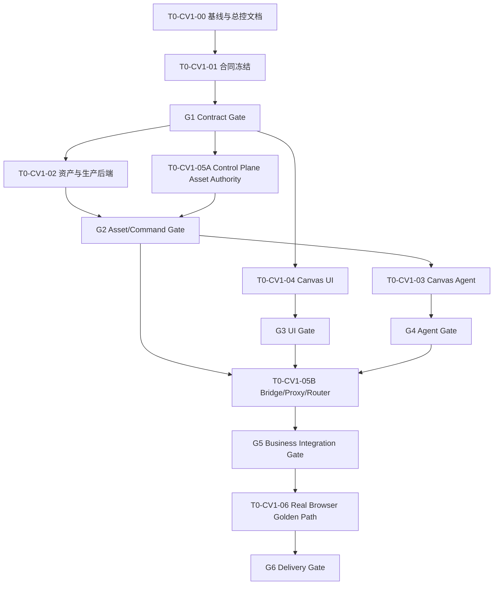

# T0-CV1 · Canvas V1 紧急融合开发总控计划

> 版本：`v0.4`
> 日期：`2026-08-14`
> 状态：`ACTIVE / EXECUTION_SOURCE_OF_TRUTH`
> 优先级：`T0 · 紧急特殊开发`
> 总控负责人：`CV0 · Codex（与用户唯一主交互窗口）`
> 适用范围：合同合并、Canvas V1、Canvas UI、业务融合

## 0. 本文的权威性

本文是本轮 T0-CV1 开发的唯一持久总控事实源。聊天、旧任务书、员工自行总结与本文冲突时，以本文最新已批准版本为准。

历史 `docs/program/ROADMAP_AND_GATES.md` 中已经存在并完成一个项目级 `T0` Gate。本轮不得改写历史 T0，也不得把历史 `T0: COMPLETE` 当作 Canvas V1 已完成。本轮所有任务、状态和 Gate 统一使用 `T0-CV1` 命名空间。

文档权限：

- 只有 CV0 可以修改本文的状态、决策、Gate 和集成记录。
- CV1—CV6 只读本文；需要变更时提交 `REQ-T0CV1-*`。
- 员工不得把聊天内容直接写成已批准事实。
- 方案使用 `PROPOSED`，只有 CV0 验收后才能改成 `ACCEPTED`。

员工开工前必须完整阅读：

1. 本文；
2. `docs/program/EMPLOYEE_RULES.md`；
3. `docs/program/AUTONOMY_PROTOCOL.md`；
4. 自己在 `docs/program/t0-canvas-v1/tasks/` 下的任务书；
5. 与任务直接相关的现有合同和验收文档。

## 1. 当前基线与保护规则

### 1.1 Git 事实

G0 放行时状态：

```text
integration worktree:
/Users/docfat/.codex/worktrees/t0-cv1-integration

integration branch:
codex/t0-cv1-integration

governance baseline:
413322708b35da7a158f45bdb329416b39238e52

G1 integrated head:
bbb475d0326b48b84941ca2a5daae4c15ec0ab5c

Wave 2 remediation product head:
1e6d0848e0142ff5aeac508057ad383d098ecad2

Wave 2 independent QA integrated head:
9d86c7cf1c2fab97ba2e2e0753bc1ec7fe8e02b4

origin/main:
19582cbf16e1414f884f9864f7c0d372640cb26a
```

原始用户工作区继续作为受保护混合工作区，不是 T0-CV1 员工代码基线。T0-CV1 产品代码冻结基线是：

```text
origin/main@19582cbf16e1414f884f9864f7c0d372640cb26a
```

CV0 已重新 fetch 并确认 `origin/main`，在独立 worktree 建立治理基线。若远端发生变化，不自动重置本轮冻结基线；由 CV0 先审计差异，再决定是否重新执行 G0。

### 1.2 当前必须保护的用户文件

以下文件或目录不得被本轮文档提交、员工暂存、删除、移动或覆盖：

```text
apps/storycanvas/data/vendor/byteplus.ts
docs/ui/VIDEOAGENT_STORE_SIMPLE_UI_V3.md
docs/ui/VIDEOAGENT_UI_SUITE_V2.md
docs/ui/assets/
output/
tmp/
```

特别规则：

```text
apps/storycanvas/data/vendor/byteplus.ts
```

继续视为用户/B-owned 受保护未跟踪文件。任何员工都不得执行 `git add .`、`git add -A` 或其他可能带入该文件的操作。

### 1.3 Git 操作纪律

- 一员工一短分支、一独立 worktree、一个明确进行中的任务。
- 禁止直接在 `main` 开发或推送。
- 禁止 `reset --hard`、`git clean`、rebase、force push。
- 禁止通过手工复制其他员工文件绕过 Git 合并。
- 员工只提交自己任务书允许的 exact paths。
- 共享文件由指定唯一写入人修改。
- CV0 决定合并顺序、冲突处理和最终集成。

建议分支：

```text
codex/t0-cv1-integration
codex/t0-cv1-contract
codex/t0-cv1-assets-production
codex/t0-cv1-agent
codex/t0-cv1-ui
codex/t0-cv1-business-integration
codex/t0-cv1-qa
```

## 2. 本轮交付目标

### 2.1 一天完成定义

本轮基础完成定义是打通以下真实纵向链路：

```text
真实用户登录
→ 打开真实门店项目
→ 读取批准脚本与批准分镜
→ 创建/读取唯一 Canvas Entry
→ Browser-safe Canvas Bootstrap
→ 加载 Canvas V1
→ 显示项目资产、人物授权与 Provider 可用状态
→ 未就绪人物资产阻止视频生成
→ 绑定已认证真人或已注册虚拟人物资产
→ UI 或 Agent 通过同一个 CanvasCommand 创建镜头任务
→ StoryCanvas 服务端解析可信资产并调用 Seedance
→ 任务结果登记为真实项目资产
→ 刷新页面后恢复 Canvas Document、绑定和任务结果
```

如果现有 FFmpeg 接口可以在不扩大风险的条件下直接复用，则追加：

```text
镜头排序 → 服务端合并 → 可播放 MP4
```

MP4 导出是本轮 Stretch Goal，不得因其未完成而伪造导出结果。

### 2.2 产品方向

Canvas V1 是门店探店视频生产工作台，不是通用创意请求页面，也不是首日复制完整 LibTV/剪映。

主流程：

```text
门店资料
→ 商品/套餐
→ 可信资产
→ 爆款参考
→ AI 探店脚本
→ 分镜
→ 镜头素材匹配/生成
→ 简单编排
→ 导出投流视频
```

首日画布形态：

```text
镜头列表
+ 当前镜头生产链
+ 资产库/Asset Dock
+ 镜头参数检查器
+ 简单成片顺序
```

首日节点：

```text
ScriptNode
AssetNode
ImageNode
VideoNode
PlaylistNode
```

### 2.3 明确非目标

首日不实现：

- 完整自由无限画布；
- 任意节点类型和任意连线；
- 多轨非线性剪辑器；
- 关键帧、复杂转场和专业调色；
- 自动化真人认证二维码全流程；
- 多人实时协作；
- 自动发布、投流和渠道回传；
- Agent 无确认批量发起高成本视频任务；
- 真实支付、提现或正式佣金结算；
- 用 Mock、Demo 或旧 `demo-local-001` 冒充真实链路。

## 3. 冻结的顶层裁决

### D-001 · 新前端、复用生产后端

```text
ACCEPTED
```

重做 Canvas V1 前端与交互层；保留并适配原 StoryCanvas 的人物资产、可信资产、连续性、模型供应商、任务、媒体存储和导出能力。

### D-002 · 受控画布

```text
ACCEPTED
```

首日不实现完全自由的 LibTV 工作流。画布使用固定生产阶段和有限节点类型，先保证真实门店项目纵向链路。

### D-003 · Creator + Agent 同一命令层

```text
ACCEPTED
```

用户操作和 Agent 操作必须调用同一个 Canvas Command Service。Agent 不直接访问数据库、Provider 或内部资产 URI。

### D-004 · 资产是生成门禁

```text
ACCEPTED
```

资产库不是附件列表，而是人物/门店/商品/品牌/声音在生成前的授权、批准、Provider 注册和项目绑定事实源。

### D-005 · 真人与虚拟人物

```text
ACCEPTED
```

- 真人：首日采用外部认证、系统同步状态；不得伪造真人已授权。
- 虚拟人物：复用现有 Image 2/Seedream 设定板与 BytePlus 资产注册链。
- Provider 未 Active、权利未授权、项目未绑定时，视频生成必须 fail-closed。

### D-006 · 版本策略

```text
ACCEPTED
```

不进行所有历史合同的大爆炸式升级。保留现有权威版本，新增 Canvas V1 聚合合同并通过 fixture/negative vectors 保证跨平面一致。

### D-007 · 正式环境失败策略

```text
ACCEPTED
```

真实环境不可用时显示真实阻塞或失败，不回退 Demo、Mock Grant、LocalStorage 或固定项目。

## 4. 四个开发工作流

### W1 · 合同合并

保留并组合：

```text
ProjectProductionPackage/0.3
ProjectGrant/0.2
CanvasEntryRedemption/0.1
Pilot Production Contract/0.2
```

新增：

```text
CanvasBootstrap/0.1
CanvasDocument/0.1
AssetRecord/0.1
ProviderAssetBinding/0.1
EntityBinding/0.1
ShotAssetRequirement/0.1
ShotReadiness/0.1
CanvasCommand/0.1
CanvasEvent/0.1
```

合同必须区分：

- Control Plane authority；
- StoryCanvas production authority；
- browser-safe projection；
- server-only authority；
- provenance/rights facts；
- status/error/idempotency；
- secret/forbidden marker。

### W2 · 画布与生产能力

复用：

- `characterAssets.ts`；
- `characterAssetBinding.ts`；
- `continuityMemory.ts`；
- `byteplusAssets.ts`；
- `byteplusTos.ts`；
- `byteplusVideo.ts`；
- Generation Task、Media Asset、FFmpeg/Receipt 基础能力。

新增：

- 生产级 Asset Adapter；
- 显式 tenant/project/package/session Scope；
- Asset Readiness；
- Canvas Document 持久化与乐观版本；
- Canvas Command Service；
- Canvas Agent Tools；
- 正式 Canvas API。

### W3 · Canvas UI

UI 必须展示：

- 当前镜头；
- 脚本/分镜事实；
- 需要的人物、门店、商品、品牌和声音资产；
- 真人/虚拟人物；
- 权利、批准、Provider、项目绑定状态；
- 候选图片/视频；
- 生成队列和失败原因；
- 保存/刷新恢复；
- 简单镜头顺序。

视觉约束：

- 暖白/浅灰底；
- 深灰文字；
- 单一橙色主操作；
- 少卡片、少装饰；
- 素材缩略图承担主要视觉；
- 不使用霓虹、玻璃拟态、复杂渐变；
- 生成视觉稿只能作为布局参考，禁止整图作为背景。

### W4 · 业务融合

正式链路：

```text
Session
→ Tenant/Project
→ approved Script/Storyboard
→ Production Package
→ Canvas Entry
→ Bridge/Proxy/Router
→ Canvas V1
→ Task/Asset/Usage Receipt
```

必须完成：

- Control Plane 管理业务资产权利和项目归属；
- StoryCanvas 管理 Provider 注册、生成任务和技术资产；
- Package/Canvas Entry/Canvas Session 精确绑定；
- 浏览器不持有 Grant、Token、Digest、raw Idempotency-Key、`asset://` 或 Provider secret；
- 生成资产回到真实项目；
- Shared Router 不再进入旧 Demo Canvas。

## 5. 资产权威与生成门禁

### 5.1 四层模型

```text
AssetRecord              Control Plane 业务资产与权利
ProviderAssetBinding     StoryCanvas Provider 注册与状态
EntityBinding            项目人物/门店/商品/品牌绑定
ShotAssetRequirement     当前镜头生成要求
```

### 5.2 生成可用条件

```text
rightsStatus == authorized
AND approvalStatus == approved
AND providerStatus == active
AND entityBinding.approved == true
AND tenant/project/package/session exact match
```

任一条件不满足：

- UI 必须显示明确原因；
- Agent 必须返回同一原因；
- 服务端拒绝创建真实视频任务；
- 不创建伪 AssetReceipt；
- 不消费成功额度。

### 5.3 Provider secret 规则

以下内容只允许存在于服务端：

```text
asset:// provider URI
provider asset/group internal id
ARK/BytePlus credentials
Canvas Entry raw access token
Project Grant
Package snapshot
internal token
digest
raw Idempotency-Key
```

浏览器只接收非秘密业务 ID、安全状态和可访问的受控预览 URL。

## 6. 数字员工组织

| 员工 | 角色 | 任务书 | 初始状态 | 阻塞条件 |
|---|---|---|---|---|
| CV0 | 总控与集成负责人 | `tasks/CV0_MASTER_INTEGRATION_TASK.md` | `IN_PROGRESS` | 无 |
| CV1 | 合同架构师 | `tasks/CV1_CONTRACT_ARCHITECT_TASK.md` | `ACCEPTED` | G1 已验收 |
| CV2 | 资产与生产后端工程师 | `tasks/CV2_ASSET_PRODUCTION_BACKEND_TASK.md` | `IN_PROGRESS` | G2 仅剩正式审批消费与 Seedance runtime adapter |
| CV3 | Canvas Agent 工程师 | `tasks/CV3_CANVAS_AGENT_TASK.md` | `READY` | 只读准备完成；G2 未通过前不写实现 |
| CV4 | Canvas UI 工程师 | `tasks/CV4_CANVAS_UI_TASK.md` | `ACCEPTED` | G3 已独立复验通过 |
| CV5 | 业务融合工程师 | `tasks/CV5_BUSINESS_INTEGRATION_TASK.md` | `IN_PROGRESS` | 05A scope remediation 已通过；05B 等待 G2/G4 |
| CV6 | QA/Gate 工程师 | `tasks/CV6_QA_GATE_TASK.md` | `READY` | G1 amendment/G2/G3 已复核；等待 runtime 与后续 Gate |

运行配置遵循 `docs/program/EMPLOYEE_RULES.md`：

```text
model: gpt-5.6-sol
reasoning: high
speed: 1.5x（客户端支持时）
```

若客户端不提供速度设置，员工报告实际配置，不得伪造已设置。

### 6.1 最大并发

任何时候最多 4 个活跃窗口，包含 CV0。推荐组合：

```text
CV0 + 最多 3 名执行员工
```

### 6.2 独占写集摘要

| 员工 | 独占写集 |
|---|---|
| CV0 | 本文、集成记录、集成分支、最终状态 |
| CV1 | `docs/program/contracts/canvas-v1/**`、约定的合同 runtime parser/fixture |
| CV2 | `apps/storycanvas/src/services/storycanvas/assets-v1/**`、`canvas-v1/**`、正式 Canvas 生产路由、对应新迁移 |
| CV3 | `apps/storycanvas/src/agents/canvas-v1/**`、`apps/storycanvas/data/skills/canvas-v1/**` |
| CV4 | `src/features/canvas-v1/components/**`、`pages/**`、`canvas-v1.css`、UI view state |
| CV5 | `apps/control-api/src/assets/**`、Canvas 业务 API、`pilotStoryCanvasBridge.ts`、`Router.tsx`、Pilot proxy、`vite.config.ts` |
| CV6 | `tests/e2e/canvas-v1/**`、Canvas V1 Gate runner/报告；产品代码只读 |

共享文件唯一写入人：

```text
src/app/Router.tsx                              CV5
src/services/pilotStoryCanvasBridge.ts          CV5
src/config/pilotE2eProxy.ts                     CV5
vite.config.ts                                  CV5
T0_CANVAS_V1_MASTER_PLAN.md                     CV0
```

## 7. Task DAG 与工作顺序



### Wave 0 · Checkpoint

活跃：CV0、CV1、CV6。

- CV0：建立事实源、fetch、基线和保护清单。
- CV1：只读审计现有合同和版本差异。
- CV6：只读运行基线测试/构建，记录已有失败。

### Wave 1 · Contract Freeze

活跃：CV0、CV1、CV6。

- CV1：Schema、fixtures、negative vectors、错误码、字段安全分类。
- CV6：合同 conformance 测试。
- CV0：裁决未决字段并验收 G1。

### Wave 2 · Parallel Build

活跃：CV0、CV2、CV4、CV5。

- CV2：资产/生产后端和 Canvas Command Service。
- CV4：使用冻结 fixture 开发 Canvas UI。
- CV5：Control Plane Asset Authority 和业务 API。
- CV0：处理 Request 和检查写集。

### Wave 3 · Agent and Shared Integration

活跃：CV0、CV3、CV5、CV6。

- CV3：Agent tools 只调用 Canvas Command Service。
- CV5：Bridge、Proxy、Router 和正式项目接入。
- CV6：安全、组件和集成 RED/GREEN。
- CV0：按固定顺序集成。

### Wave 4 · Golden Path

活跃：CV0、CV6，以及最多一名返工 Owner。

- dedicated PostgreSQL `_test`；
- Control API、StoryCanvas、Vite 三服务；
- 真实 Chrome；
- 真实项目/资产门禁/任务；
- 刷新恢复；
- 全量回归和证据。

## 8. Gate

| Gate | Owner | 放行条件 | 未通过禁止 |
|---|---|---|---|
| G0 Baseline | CV0/CV6 | fetch 后 SHA、保护文件、基线测试、分支/worktree 计划明确 | 禁止多窗口写产品代码 |
| G1 Contract | CV1/CV6/CV0 | Schema、fixture、negative vector、状态、ID、错误、安全投影一致 | 禁止 CV2/CV4/CV5 正式实现 |
| G2 Asset/Command | CV2/CV5/CV6 | 未认证阻断、Active 资产绑定、Scope、命令幂等、持久化通过 | 禁止 Agent 和真实视频生成 |
| G3 UI | CV4/CV6 | 真实状态、明确失败、刷新恢复、无旧 MVP API、可访问性 smoke | 禁止切正式路由 |
| G4 Agent | CV3/CV6 | Agent/UI 共用命令，不能绕过资产/审批/成本门禁 | 禁止 Agent 批量生产 |
| G5 Business Integration | CV5/CV0/CV6 | Tenant/Project/Package/Session 精确绑定，Bridge/Proxy/Router fail-closed | 禁止进入最终 Golden Path |
| G6 Delivery | CV6/CV0 | 真实浏览器、真实项目、真实任务、无秘密泄漏、全量回归 | 禁止宣称 Canvas V1 完成 |

Gate 状态：

| Gate | 当前状态 | 证据/说明 |
|---|---|---|
| G0 | `ACCEPTED` | `handoffs/CV6_G0_BASELINE_HANDOFF.md`；带已知基线失败放行 |
| G1 | `ACCEPTED` | 含 EntityBinding missing amendment；66/66 PASS、10 fixtures、38/38 双 parser parity |
| G2 | `BLOCKED` | Scope/持久化已通过；StoryCanvas production runtime 尚缺 Control approval consumption 与真实 Seedance adapter |
| G3 | `ACCEPTED` | CV4 owner 31/31、CV6 独立三项回归 3/3；审批、状态恢复和五个媒体 sink 均 fail-closed |
| G4 | `NOT_STARTED` | 依赖 G2 |
| G5 | `NOT_STARTED` | 依赖 G2/G3/G4 |
| G6 | `NOT_STARTED` | 依赖 G5 |

状态词只使用：

```text
NOT_STARTED
READY
IN_PROGRESS
BLOCKED
READY_FOR_GATE
ACCEPTED
```

## 9. 联合状态口径

新状态只能按真实证据推进：

```text
CANVAS_V1_CONTRACT_FROZEN
CANVAS_V1_ASSET_GATE_READY
CANVAS_V1_COMMAND_READY
CANVAS_V1_UI_READY
CANVAS_V1_AGENT_READY
CANVAS_V1_BUSINESS_INTEGRATED
CANVAS_V1_GOLDEN_PATH_PASS
```

当前继续保持：

```text
CANVAS_V1_CONTRACT_FROZEN
CANVAS_V1_UI_READY
B_REMEDIATION_ACCEPTED
SHARED_ACTIVATION_GREEN_READY_FOR_PLANNING
AB_GOLDEN_PATH_NOT_IMPLEMENTED
FULL_JOINT_GATE_STILL_BLOCKED
```

在 G6 通过前不得宣称：

```text
REAL_EDITOR_LOADED
CANVAS_V1_COMPLETE
AB_GOLDEN_PATH_COMPLETE
JOINT_GATE_PASS
FULL_JOINT_GATE_PASS
```

## 10. 员工交互协议

### 10.1 开工报告

每名员工首次报告必须包含：

```text
employee/task id
model/reasoning/actual speed configuration
repository/worktree
branch
baseline full SHA
master plan version read
exact intended write set
explicit no-write set
planned RED/tests
known blockers
```

配置或基线不符时先暂停，不得开始写代码。

### 10.2 Request

编号：

```text
REQ-T0CV1-{发起员工}-{三位序号}
```

必须包含：

- 请求内容；
- 请求原因；
- 合同/文件影响；
- 是否阻塞；
- 临时方案；
- 期望 Owner；
- 目标 Gate。

只有 CV0 可以批准跨域修改。

### 10.3 Handoff

每次交付必须包含：

```text
task id
baseline and final full SHA
atomic commits
exact changed paths
implemented contracts
test commands and exact results
security/secret evidence
known failures
unfinished items
rollback method
downstream first step
```

### 10.4 更新频率

- 员工状态发生变化时向 CV0 报告，不直接更新本文。
- 进行中的员工每个原子切片结束必须报告。
- 遇到真实合同冲突、跨写集需求或秘密/授权风险时立即报告。
- 普通实现选择由员工在边界内自主处理。
- CV0 只在 Gate、真实阻塞或需要用户决策时向用户汇报。

## 11. 固定集成顺序

```text
1. Contract
2. Control Plane Asset Authority
3. StoryCanvas Asset/Command
4. Canvas UI
5. Canvas Agent
6. Shared Bridge/Proxy/Router
7. E2E/Gate
```

每次集成前 CV0 必须验证：

- commit object；
- baseline ancestor；
- exact write set；
- `git diff --check`；
- 任务 targeted tests；
- 不包含受保护文件；
- 没有旧 Demo/Mock fallback；
- 回滚方法存在。

## 12. 通用员工启动提示词

以下前缀必须出现在 CV1—CV6 的正式启动提示词中：

```text
你是 T0-CV1 紧急开发数字员工。开工前完整阅读：
1. docs/program/t0-canvas-v1/T0_CANVAS_V1_MASTER_PLAN.md
2. docs/program/EMPLOYEE_RULES.md
3. docs/program/AUTONOMY_PROTOCOL.md
4. 你的 T0-CV1 任务书

先只读核对仓库、分支、baseline SHA、Master Plan 版本和工作区状态，
然后报告 exact intended write set 与 explicit no-write set。配置或基线不符时暂停。

只修改任务书声明的独占写集。不得触碰、暂存或提交：
apps/storycanvas/data/vendor/byteplus.ts

不得使用 Demo Grant、Mock 成功、LocalStorage、SessionStorage、固定
demo-local-001 或旧 /api/mvp/* 替代正式能力。不得 reset --hard、git clean、
rebase、force push，不得 git add .。

UI 和 Agent 必须通过同一个 Canvas Command Service。任何合同冲突通过
REQ-T0CV1 提交，不自行改写共享合同或他人文件。按 RED → GREEN → 回归推进，
每个任务形成原子 commit。完成后提供 full SHA、exact paths、真实测试结果、
安全证据、风险、未完成项、回滚方法和下游第一步。
```

## 13. 横向强制约束

四个工作流必须共同满足：

1. 资产授权与权利生命周期；
2. Canvas Document 版本与乐观锁；
3. 命令幂等、response-loss replay 和 changed-payload rejection；
4. Provider secret、Package/Grant 和浏览器隔离；
5. Feature Flag 与旧画布可控回退入口；
6. 数据库迁移、回滚和临时数据根；
7. 开源来源、许可证和 NOTICE；
8. Request ID、错误包络、任务诊断和日志脱敏；
9. 真实能力不可用时 fail-closed；
10. 高成本模型调用前的明确用户确认和使用量记录。

## 14. CV0 决策升级边界

CV0 可以自行决定：

- 任务拆分和员工启动顺序；
- 普通技术实现；
- 测试和返工安排；
- 不改变合同语义的字段命名修正；
- 已批准范围内的分支和集成方式。

CV0 必须向用户升级：

- 改变首日完成定义；
- 从受控画布改为完整自由无限画布；
- 引入需要付费或限制商业使用的核心编辑器；
- 真人授权、肖像权、版权或隐私规则变化；
- 真实模型密钥、采购、付款、正式部署或对外发布；
- 删除/替换现有生产后端；
- 无法 fast-forward/安全集成且需要重写历史；
- 需要触碰受保护 `byteplus.ts`。

## 15. 验收证据清单

G6 最少需要：

1. fetch 后 baseline full SHA；
2. 所有员工原子 commit 与 exact paths；
3. 合同 schema/fixture/negative vector PASS；
4. 未认证人物 UI、Agent、服务端三层阻断；
5. Active 可信资产绑定与连续性 revision 更新；
6. UI/Agent 同一 CanvasCommand 证明；
7. 真实项目 Canvas Bootstrap；
8. 真实 Seedance task id 和安全状态证据；
9. 生成结果归属 tenant/project/package/session；
10. 刷新恢复；
11. 浏览器/DOM/URL/Storage/console/日志无秘密字段；
12. Root build、StoryCanvas build、targeted tests、Governance、diff-check；
13. `apps/storycanvas/data/vendor/byteplus.ts` 未触碰证明；
14. 旧 Shared RED 不被删除、skip 或弱化；
15. 尚未完成的 MP4/Golden Path/Joint Gate 明确说明。

## 16. 当前执行入口

用户已正式启动 T0-CV1。G0 已由 CV6 完成并由 CV0 以
`ACCEPT_WITH_KNOWN_BASELINE_FAILURES` 放行；G1（含 additive amendment）和
G3 已由 CV0 验收。Wave 2 当前只剩 G2 runtime activation：

```text
1. CV2 已完成资产门禁、Document、Canvas Command Service 与安全 runtime route
2. CV5 05A 已完成 Control 资产、不可变 Canvas Session authority 与 exact scope
3. CV4 已完成 UI，并关闭 approval、prompt refresh 与 browser media sink 缺口
4. CV2 继续接通 server-only Control approval consumption 与真实 Seedance adapter
5. CV3 只读准备完成，G2 ACCEPTED 后才进入 Agent RED/GREEN
6. CV5 05B 只读准备中，继续等待 G2/G4；G3 已放行
```

G1 证据：

```text
CV1-A inventory:        9690885765b2ffeb308e06e3a17b416439996578
CV1-B fixtures/RED:     1f2b2abd47e9b0a92730f61cf8d1ca63e7a60e96
CV1-C parsers/GREEN:    898b3067f4d82e302e67fa735baf80e61c7fabe7
CV1-D handoff:          2f7939433dee7632b9e188ba4fbabc9365a79b7c
CV6 RED:                a5b3ac79ac35ce8bff463f8b5525d4e8588df3f0
CV6 GREEN:              a03432891d440c51d0906948adb84db6593fa50b
CV6 handoff:            7dd0caed9b817b106d33e1be14f5777f8a52e074
Contract Gate:          60 PASS / 0 FAIL / 0 SKIP/TODO
Negative-vector parity: 37/37 frontend/backend stable-code PASS

Wave 2 independent revalidation:
CV6 test:                  8e8d5037cbc8b040deb82340e17e2ad09dab3648
CV6 handoff:               9d86c7cf1c2fab97ba2e2e0753bc1ec7fe8e02b4
G1 amendment gate:         66/66 PASS; 10 fixtures; 38/38 parity
G2 production-wired scope: 3/3 PASS; Story 005 + PostgreSQL 025/026 PASS
G3 independent regressions: 3/3 PASS; owner suite 31/31 PASS
G2 remaining blocker:      approval consumption + Seedance runtime adapter
```

G0 已知基线事实：

```text
StoryCanvas:                         69/69 PASS
StoryCanvas v0.2:                   13/13 PASS
Media/TTS/Storage:                  17/17 PASS
Root/Control/StoryCanvas builds:    PASS
Governance/diff-check:              PASS
Root suite:                         431 PASS / 4 historical Shared RED
Historical contract gate:           outer 9/10; stale A3 child 4/10
Control API without _test database: 447 PASS / 236 SKIP
Full Joint Gate:                    BLOCKED as designed
```

这些失败不归因于 T0-CV1，也不得在后续被删除、skip、弱化或伪报为 PASS。

## 17. 变更记录

### v0.4 · 2026-08-14

- 集成 CV2/CV4/CV5 Wave 2 产品切片与 CV6 独立复验；
- 接受 EntityBinding missing amendment，合同 Gate 更新为 10 fixtures、38 vectors、66/66 PASS；
- 新建并验证本机隔离数据库 `videoagent_control_test`，PostgreSQL 025/026 与迁移链真实通过；StoryCanvas 005 同步通过；
- 修复 Control Canvas Session exact scope、response-loss replay、registration fail-closed 与内部 token 比较；
- 修复 UI 高成本绑定 approval、同镜头新文档版本 prompt 恢复与全部 browser media sink；
- CV0 将 G3 标记为 `ACCEPTED`；
- G2 保持 `BLOCKED`：正式 StoryCanvas runtime 尚未注入 Control approval consumption 和 Seedance production adapter；
- CV3 与 CV5 05B 仅完成只读准备，不越过 G2/G4 Gate。

### v0.3 · 2026-08-14

- CV0 集成 CV1 四个合同提交与 CV6 G1 RED/GREEN/证据提交；
- 九个 Canvas V1 additive contracts、canonical fixtures、37 个 negative vectors、前后端 strict parser 已冻结；
- CV6 独立 Gate 60/60 PASS，CV0 将 G1 标记为 `ACCEPTED`；
- 新增联合状态 `CANVAS_V1_CONTRACT_FROZEN`；
- 启动 Wave 2：CV2、CV4、CV5；CV5 当前只获准执行 05A。

### v0.2 · 2026-08-14

- 用户正式启动 Wave 0；CV1、CV6 均以 `gpt-5.6-sol/high` 执行；
- 冻结 `origin/main@19582cbf16e1414f884f9864f7c0d372640cb26a` 与治理基线 `413322708b35da7a158f45bdb329416b39238e52`；
- CV6 完成 G0 baseline matrix，CV0 接受带已知基线失败放行；
- CV1 完成零写入合同审计，识别并由 CV0 裁决八项 G1 必修边界；
- G1 进入 `IN_PROGRESS`，G2—G6 保持未启动。

### v0.1 · 2026-08-14

- 建立 T0-CV1 唯一总控事实源；
- 冻结四个工作流、七名数字员工、写集、DAG 与 G0—G6；
- 冻结受控画布、资产门禁、Creator + Agent 同一命令层；
- 记录本地与远端基线及受保护文件；
- 尚未招聘员工，尚未修改产品代码。
